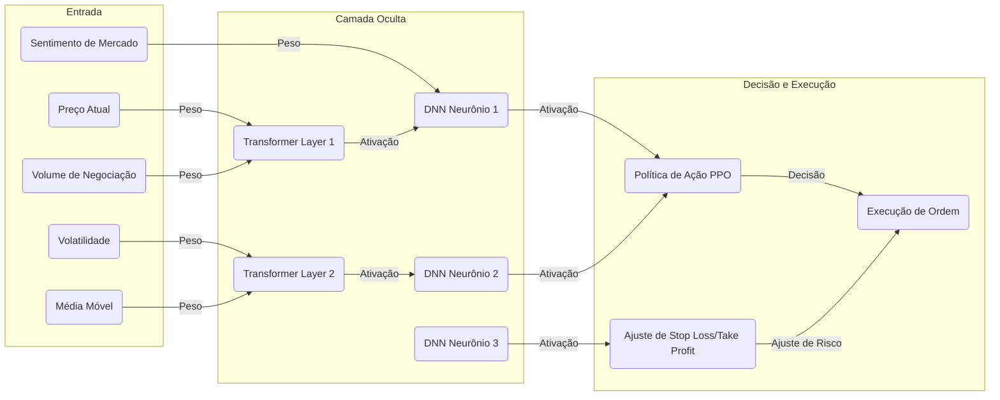
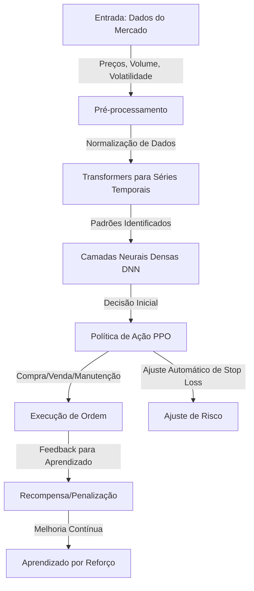

# 🏦 Agente Nexo - Investimento Conservador

Este é um programa automático que ajuda a investir em Bitcoin (BTC) na plataforma **Nexo**. Ele segue estratégias **seguras** e **conservadoras**, ajustando os limites de perda (**stop loss**) e ganho (**take profit**) a cada minuto. Além disso, ele envia **notificações pelo Telegram** para que você acompanhe tudo em tempo real. 📩

---

## 📌 Sumário
- [Introdução](#introdução)
- [Objetivos](#objetivos)
- [Como Funciona](#como-funciona)
- [Tecnologias Usadas](#tecnologias-usadas)
- [Instalação](#instalação)
- [Configuração do Agente](#configuração-do-agente)
- [Execução](#execução)
- [Rede Neural e Treinamento](#rede-neural-e-treinamento)
- [Pipeline CI/CD](#pipeline-cicd)
- [Contribuições](#contribuições)
- [Licença](#licença)

---

## 🏁 Introdução

O mercado de criptomoedas muda muito rápido. Este agente usa **inteligência artificial** para analisar os preços do BTC/USDT e decidir automaticamente **quando comprar e quando vender**. Ele sempre busca uma estratégia segura, mantendo o risco baixo. 

Agora, com **notificações via Telegram**, você pode receber mensagens sobre **novas operações**, **ajustes de limite**, **ordens executadas** e **alertas importantes** diretamente no seu celular. 📲

---

## 🎯 Objetivos
✔️ Operar no mercado de futuros BTC/USDT na Nexo.  
✔️ Ajustar **stop loss** e **take profit** automaticamente.  
✔️ Aplicar uma **estratégia segura** para evitar grandes perdas.  
✔️ Controlar **alavancagem** para evitar riscos desnecessários.  
✔️ **Enviar notificações via Telegram** para monitoramento em tempo real.  

---

## 🤖 Como Funciona

O agente usa **inteligência artificial** para analisar o mercado e decidir o melhor momento para comprar ou vender BTC. Ele utiliza uma **rede neural avançada**, que aprende com dados passados para melhorar as decisões futuras.

- **Transformers para analisar padrões de preços** 📈
- **Rede Neural para processar dados do mercado** 🔍
- **Sistema de recompensas para aprender boas estratégias** 🎯

A cada minuto, o agente:
1. Coleta os preços mais recentes do BTC/USDT.
2. Analisa as tendências e padrões do mercado.
3. Ajusta os limites de **stop loss** e **take profit**.
4. Toma decisões sobre **comprar ou vender**.
5. Envia alertas no Telegram com informações importantes.

---

## 🛠️ Tecnologias Usadas
- **Python** 🐍
- **Bibliotecas:**
  - `tensorflow`, `keras` → Rede neural 🧠
  - `transformers` → Análise de padrões 🔎
  - `stable-baselines3` → Aprendizado por reforço 📊
  - `requests` → Comunicação com a API da Nexo 🔗
  - `pandas`, `numpy` → Processamento de dados 📉
  - `schedule` → Execução automática ⏳
  - `telepot` → Notificações no Telegram 📩

---

## 📚 Rede Neural e Treinamento

A **rede neural** do agente é composta por **três módulos principais**:

### 🧠 Arquitetura da Rede Neural
1. **Módulo de Entrada**: Processa os dados do mercado, incluindo preços, volume e volatilidade.
2. **Módulo de Processamento**: Usa **Transformers** para detectar padrões em séries temporais e redes neurais profundas (**DNN**) para refinar a análise dos dados.
3. **Módulo de Decisão**: Implementa **Aprendizado por Reforço Profundo (PPO - Proximal Policy Optimization)** para ajustar automaticamente a estratégia de trading.

### 🔄 Fluxo de Treinamento
1. **Coleta de dados** 📊: Obtém preços do BTC, volume de negociação e outras informações do mercado.
2. **Pré-processamento** 🔍: Filtra dados e remove informações irrelevantes.
3. **Treinamento supervisionado** 🎓: Aprende padrões de comportamento a partir de dados passados.
4. **Treinamento por Reforço (PPO)** 🏆: Testa diferentes estratégias e aprende quais funcionam melhor.
5. **Backtesting** 🔄: Simula operações para ver como o modelo se sairia em diferentes cenários.
6. **Ajustes contínuos** 📈: O agente melhora ao longo do tempo, adaptando-se ao mercado.

### 📊 Diagrama Detalhado da Rede Neural


🚀 **Essa arquitetura melhora a capacidade do agente de aprender padrões do mercado e tomar decisões mais assertivas!**


---

🚀 **Com essa arquitetura, o agente pode aprender com o mercado, detectar padrões mais rapidamente e melhorar suas decisões ao longo do tempo!**

---

Aqui está a estrutura do projeto e a explicação de cada arquivo:

## 1. Estrutura do Projeto
```
nexo_futures_ai/
│-- data/                # Armazena dados brutos e processados
│-- models/              # Modelos treinados e checkpoints
│-- scripts/             # Scripts de execução rápida
│-- notebooks/           # Notebooks para exploração de dados e testes
│-- configs/             # Configurações do projeto
│-- logs/                # Logs de execução e treinamento
│-- src/                 # Código-fonte principal
│   │-- __init__.py      # Torna 'src' um pacote Python
│   │-- data_loader.py   # Carrega e processa os dados
│   │-- model.py         # Define a rede neural
│   │-- train.py         # Script de treinamento do modelo
│   │-- evaluate.py      # Avalia o modelo treinado
│   │-- utils.py         # Funções auxiliares
│-- README.md            # Documentação do projeto
│-- .gitignore           # Arquivos a serem ignorados pelo Git
│-- requirements.txt     # Lista de dependências do projeto
│-- configs/config.yaml  # Arquivo de configuração
```

## 2. Explicação de Cada Arquivo

### Diretórios:
- **data/**: Armazena os dados brutos (ex: histórico de preços) e os dados processados.
- **models/**: Guarda os modelos treinados e checkpoints para futuras execuções.
- **scripts/**: Scripts utilitários que podem ser rodados separadamente.
- **notebooks/**: Contém Jupyter Notebooks para análise e testes interativos.
- **configs/**: Armazena arquivos de configuração para parametrização do projeto.
- **logs/**: Contém arquivos de log gerados durante execuções do treinamento e testes.
- **src/**: Contém o código-fonte principal do projeto.

### Arquivos:
- **README.md**: Explica o objetivo do projeto, como rodá-lo e suas dependências.
- **.gitignore**: Arquivo que informa ao Git quais arquivos e pastas devem ser ignorados no versionamento.
- **requirements.txt**: Lista todas as dependências (bibliotecas) que o projeto precisa para rodar corretamente.
- **configs/config.yaml**: Define configurações do projeto, como hiperparâmetros e caminhos dos dados.

### Arquivos em `src/`:
- **__init__.py**: Torna a pasta um pacote Python, permitindo importação de módulos.
- **data_loader.py**: Contém funções para carregar, limpar e processar os dados de entrada.
- **model.py**: Define a arquitetura da rede neural (ex: LSTM, CNN, MLP).
- **train.py**: Responsável por treinar o modelo usando os dados de entrada.
- **evaluate.py**: Mede o desempenho do modelo treinado usando métricas de avaliação.
- **utils.py**: Contém funções auxiliares como normalização de dados e visualização.

Essa estrutura ajuda a manter o projeto organizado e modular, facilitando o desenvolvimento e a manutenção.


