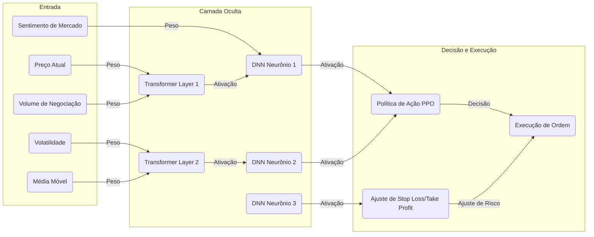
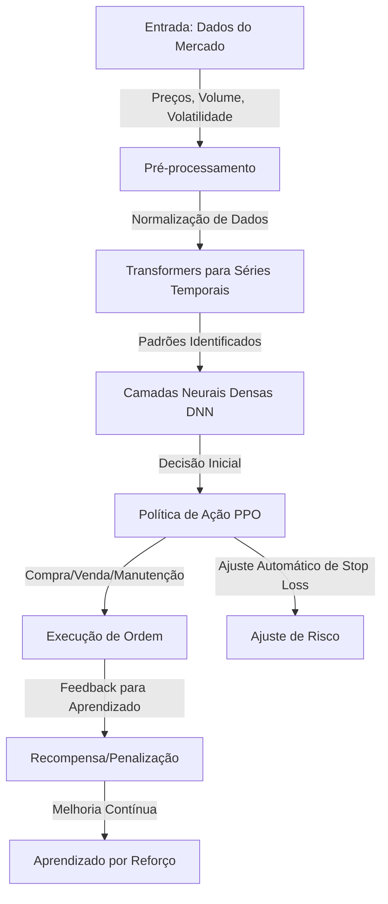
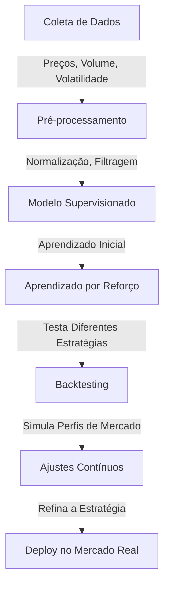
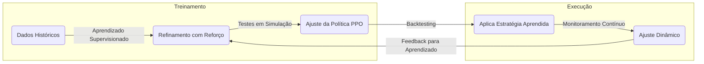
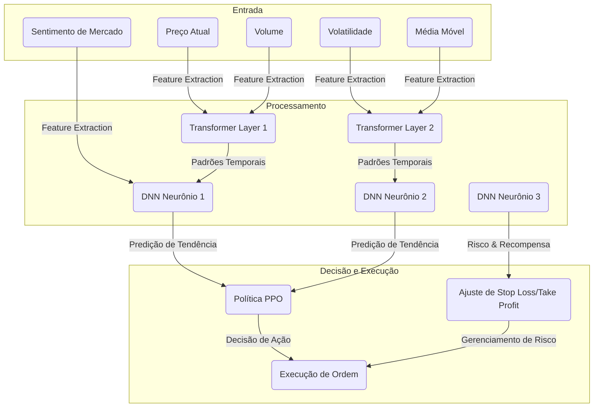

# 🏦 Agente Nexo - Investimento Conservador

Este é um programa automático que ajuda a investir em Bitcoin (BTC) na plataforma **Nexo**. Ele segue estratégias **seguras** e **conservadoras**, ajustando os limites de perda (**stop loss**) e ganho (**take profit**) a cada minuto. Além disso, ele envia **notificações pelo Telegram** para que você acompanhe tudo em tempo real. 📩

---

## 📌 Sumário
- [Introdução](#introdução)
- [Objetivos](#objetivos)
- [Como Funciona](#como-funciona)
- [Tecnologias Usadas](#tecnologias-usadas)
- [Instalação](#instalação)
- [Configuração do Agente](#configuração-do-agente)
- [Execução](#execução)
- [Rede Neural e Treinamento](#rede-neural-e-treinamento)
- [Pipeline CI/CD](#pipeline-cicd)
- [Contribuições](#contribuições)
- [Licença](#licença)

---

## 🏁 Introdução

O mercado de criptomoedas muda muito rápido. Este agente usa **inteligência artificial** para analisar os preços do BTC/USDT e decidir automaticamente **quando comprar e quando vender**. Ele sempre busca uma estratégia segura, mantendo o risco baixo. 

Agora, com **notificações via Telegram**, você pode receber mensagens sobre **novas operações**, **ajustes de limite**, **ordens executadas** e **alertas importantes** diretamente no seu celular. 📲

---

## 🎯 Objetivos
✔️ Operar no mercado de futuros BTC/USDT na Nexo.  
✔️ Ajustar **stop loss** e **take profit** automaticamente.  
✔️ Aplicar uma **estratégia segura** para evitar grandes perdas.  
✔️ Controlar **alavancagem** para evitar riscos desnecessários.  
✔️ **Enviar notificações via Telegram** para monitoramento em tempo real.  

---

## 🤖 Como Funciona

O agente usa **inteligência artificial** para analisar o mercado e decidir o melhor momento para comprar ou vender BTC. Ele utiliza uma **rede neural avançada**, que aprende com dados passados para melhorar as decisões futuras.

- **Transformers para analisar padrões de preços** 📈
- **Rede Neural para processar dados do mercado** 🔍
- **Sistema de recompensas para aprender boas estratégias** 🎯

A cada minuto, o agente:
1. Coleta os preços mais recentes do BTC/USDT.
2. Analisa as tendências e padrões do mercado.
3. Ajusta os limites de **stop loss** e **take profit**.
4. Toma decisões sobre **comprar ou vender**.
5. Envia alertas no Telegram com informações importantes.

---

## 🛠️ Tecnologias Usadas
- **Python** 🐍
- **Bibliotecas:**
  - `tensorflow`, `keras` → Rede neural 🧠
  - `transformers` → Análise de padrões 🔎
  - `stable-baselines3` → Aprendizado por reforço 📊
  - `requests` → Comunicação com a API da Nexo 🔗
  - `pandas`, `numpy` → Processamento de dados 📉
  - `schedule` → Execução automática ⏳
  - `telepot` → Notificações no Telegram 📩

---

## 📚 Rede Neural e Treinamento

A **rede neural** do agente é composta por **três módulos principais**:

### 🧠 Arquitetura da Rede Neural
1. **Módulo de Entrada**: Processa os dados do mercado, incluindo preços, volume e volatilidade.
2. **Módulo de Processamento**: Usa **Transformers** para detectar padrões em séries temporais e redes neurais profundas (**DNN**) para refinar a análise dos dados.
3. **Módulo de Decisão**: Implementa **Aprendizado por Reforço Profundo (PPO - Proximal Policy Optimization)** para ajustar automaticamente a estratégia de trading.

### 🔄 Fluxo de Treinamento
1. **Coleta de dados** 📊: Obtém preços do BTC, volume de negociação e outras informações do mercado.
2. **Pré-processamento** 🔍: Filtra dados e remove informações irrelevantes.
3. **Treinamento supervisionado** 🎓: Aprende padrões de comportamento a partir de dados passados.
4. **Treinamento por Reforço (PPO)** 🏆: Testa diferentes estratégias e aprende quais funcionam melhor.
5. **Backtesting** 🔄: Simula operações para ver como o modelo se sairia em diferentes cenários.
6. **Ajustes contínuos** 📈: O agente melhora ao longo do tempo, adaptando-se ao mercado.

### 📊 Diagrama Detalhado da Rede Neural


🚀 **Essa arquitetura melhora a capacidade do agente de aprender padrões do mercado e tomar decisões mais assertivas!**


---

🚀 **Com essa arquitetura, o agente pode aprender com o mercado, detectar padrões mais rapidamente e melhorar suas decisões ao longo do tempo!**

---

# 📈 Training Scenarios for Agente Nexo

## 🏆 Objetivo
Este documento define diferentes **cenários de treinamento** para o agente Nexo, permitindo que ele aprenda a tomar **decisões de investimento** da melhor forma possível em **diferentes condições de mercado**.

O treinamento será dividido em **jogos/simulações**, onde o agente enfrentará desafios e aprenderá **estratégias vencedoras**.

---

## 🎮 Jogos e Cenários de Treinamento

### **1️⃣ Jogo: Mercado de Baixa Extrema (Bear Market)**
🔹 **Objetivo:** Ensinar o agente a **evitar perdas** e identificar pontos de entrada seguros.
🔹 **Cenário:**
   - O mercado cai 10% em um curto período.
   - O agente precisa decidir se **mantém a posição, vende ou espera**.
   - Se ele vender muito cedo, pode perder um possível repique.
   - Se ele segurar muito tempo, pode sofrer grandes perdas.
🔹 **Recompensa:**
   - Se evitar perdas acima de 5% e encontrar um **ponto de entrada lucrativo**, recebe uma **recompensa alta**.
   - Se segurar demais e não conseguir recuperar, recebe **penalização**.

### **2️⃣ Jogo: Mercado Lateral (Consolidação)**
🔹 **Objetivo:** Ensinar o agente a operar em **mercados sem tendência**.
🔹 **Cenário:**
   - O preço oscila entre 40.000 e 42.000 USDT.
   - O agente deve aprender a **comprar na parte inferior e vender na parte superior**.
   - Se ele operar fora dessas faixas, pode sofrer **prejuízos desnecessários**.
🔹 **Recompensa:**
   - Se fizer **entradas e saídas precisas dentro da faixa**, recebe **recompensa alta**.
   - Se comprar ou vender nos momentos errados, recebe **penalização**.

### **3️⃣ Jogo: Pump & Dump (Volatilidade Extrema)**
🔹 **Objetivo:** Ensinar o agente a **evitar armadilhas e capturar movimentos rápidos**.
🔹 **Cenário:**
   - O mercado sobe rapidamente 15% e depois cai 20%.
   - O agente precisa decidir **se entra na alta ou espera uma correção**.
🔹 **Recompensa:**
   - Se identificar corretamente um **ponto de entrada seguro**, recebe **recompensa**.
   - Se entrar muito tarde e sofrer perdas com a correção, recebe **penalização**.

### **4️⃣ Jogo: Notícias Impactantes**
🔹 **Objetivo:** Ensinar o agente a **adaptar-se a eventos inesperados**.
🔹 **Cenário:**
   - Uma **notícia impactante** surge, alterando o sentimento do mercado.
   - O agente deve identificar se a notícia **gera uma nova tendência ou apenas ruído**.
🔹 **Recompensa:**
   - Se ajustar sua estratégia corretamente de acordo com a **notícia**, recebe **recompensa alta**.
   - Se entrar cedo demais ou ignorar o impacto real, recebe **penalização**.

### **5️⃣ Jogo: Flash Crash (Queda Rápida e Recuperação)**
🔹 **Objetivo:** Ensinar o agente a **reagir rapidamente e identificar oportunidades**.
🔹 **Cenário:**
   - O BTC despenca 10% em minutos, mas recupera 8% logo depois.
   - O agente precisa aprender a **não vender no pânico** e procurar oportunidades de compra.
🔹 **Recompensa:**
   - Se conseguir **comprar no momento certo**, recebe **recompensa alta**.
   - Se vender no fundo por medo, recebe **penalização**.

---

## 🧠 Como o Agente Aprende a Melhor Estratégia?

1. **Simulações Massivas**
   - O agente é testado **milhares de vezes** em cada cenário.
   - Cada simulação ajusta os pesos da rede neural para **evitar erros futuros**.

2. **Recompensa por Decisões Certas**
   - O modelo de aprendizado por reforço **recompensa boas decisões** e **penaliza erros**.
   - Cada jogo reforça **padrões de comportamento eficiente**.

3. **Ajustes Contínuos**
   - Após o treinamento inicial, o agente continua aprendendo **com o mercado ao vivo**.
   - Se um novo padrão de mercado surgir, o agente pode **se adaptar automaticamente**.

---

🚀 **Com esses jogos de treinamento, o agente poderá operar de forma mais inteligente e segura no mercado de futuros BTC/USDT!**


---

## 1. Estrutura do Projeto
```
nexo_futures_ai/
│-- data/                # Armazena dados brutos e processados
│-- models/              # Modelos treinados e checkpoints
│-- scripts/             # Scripts de execução rápida
│-- notebooks/           # Notebooks para exploração de dados e testes
│-- configs/             # Configurações do projeto
│-- logs/                # Logs de execução e treinamento
│-- src/                 # Código-fonte principal
│   │-- __init__.py      # Torna 'src' um pacote Python
│   │-- data_loader.py   # Carrega e processa os dados
│   │-- model.py         # Define a rede neural
│   │-- train.py         # Script de treinamento do modelo
│   │-- evaluate.py      # Avalia o modelo treinado
│   │-- utils.py         # Funções auxiliares
│-- README.md            # Documentação do projeto
│-- .gitignore           # Arquivos a serem ignorados pelo Git
│-- requirements.txt     # Lista de dependências do projeto
│-- configs/config.yaml  # Arquivo de configuração
```

## 2. Explicação de Cada Arquivo

### Diretórios:
- **data/**: Armazena os dados brutos (ex: histórico de preços) e os dados processados.
- **models/**: Guarda os modelos treinados e checkpoints para futuras execuções.
- **scripts/**: Scripts utilitários que podem ser rodados separadamente.
- **notebooks/**: Contém Jupyter Notebooks para análise e testes interativos.
- **configs/**: Armazena arquivos de configuração para parametrização do projeto.
- **logs/**: Contém arquivos de log gerados durante execuções do treinamento e testes.
- **src/**: Contém o código-fonte principal do projeto.

### Arquivos:
- **README.md**: Explica o objetivo do projeto, como rodá-lo e suas dependências.
- **.gitignore**: Arquivo que informa ao Git quais arquivos e pastas devem ser ignorados no versionamento.
- **requirements.txt**: Lista todas as dependências (bibliotecas) que o projeto precisa para rodar corretamente.
- **configs/config.yaml**: Define configurações do projeto, como hiperparâmetros e caminhos dos dados.

### Arquivos em `src/`:
- **__init__.py**: Torna a pasta um pacote Python, permitindo importação de módulos.
- **data_loader.py**: Contém funções para carregar, limpar e processar os dados de entrada.
- **model.py**: Define a arquitetura da rede neural (ex: LSTM, CNN, MLP).
- **train.py**: Responsável por treinar o modelo usando os dados de entrada.
- **evaluate.py**: Mede o desempenho do modelo treinado usando métricas de avaliação.
- **utils.py**: Contém funções auxiliares como normalização de dados e visualização.

Essa estrutura ajuda a manter o projeto organizado e modular, facilitando o desenvolvimento e a manutenção.

---

## Tests

Aqui está um roteiro detalhado para a criação do projeto **Agente Nexo - Investimento Conservador**.

---

## 📌 **Roteiro para a Criação do Projeto**

### **1️⃣ Planejamento Inicial**
1. **Definir os objetivos do agente**
   - O agente deve operar de forma conservadora no mercado de futuros BTC/USDT.
   - Ajuste dinâmico de **stop loss** e **take profit** para evitar perdas excessivas.
   - Envio de notificações via **Telegram** para monitoramento contínuo.

2. **Escolher as tecnologias e ferramentas**
   - **Linguagem**: Python
   - **Frameworks para Machine Learning**: TensorFlow, Keras, Stable-Baselines3
   - **APIs**: API da Nexo para ordens e preços
   - **Banco de Dados**: SQLite/PostgreSQL (para armazenar histórico de operações)
   - **Serviço de Mensageria**: Telegram Bot API
   - **Ferramentas de CI/CD**: GitHub Actions + Docker

---

### **2️⃣ Coleta e Processamento de Dados**
1. **Coletar dados de mercado**
   - Criar um script Python para acessar a API da Nexo e buscar preços, volumes, médias móveis e volatilidade.
   - Armazenar os dados em um banco de dados.

2. **Pré-processamento dos dados**
   - Remover outliers e normalizar dados.
   - Criar novos indicadores técnicos relevantes para a decisão do agente.

---

### **3️⃣ Desenvolvimento da Rede Neural**
1. **Definição da Arquitetura**
   - **Entrada**: Preço atual, volume, volatilidade, médias móveis, sentimento de mercado.
   - **Camada Oculta**:
     - **Transformers** para análise de séries temporais.
     - **Redes Neurais Densas (DNNs)** para combinação de múltiplas features.
   - **Saída**:
     - Decisão de **compra, venda ou manutenção** da posição.
     - Ajuste dinâmico de **stop loss** e **take profit**.

2. **Treinamento do Modelo**
   - Treinar inicialmente com **dados históricos** para aprendizado supervisionado.
   - Refinar a estratégia com **Aprendizado por Reforço Profundo (PPO)**.
   - Realizar **backtesting** para testar a eficiência do modelo antes da implantação.

---

### **4️⃣ Implementação do Sistema de Execução de Ordens**
1. **Conectar o agente à API da Nexo**
   - Criar funções para enviar ordens de compra e venda.
   - Monitorar posições abertas e ajustar **stop loss** e **take profit** dinamicamente.

2. **Gerenciamento de Risco**
   - Implementar controle de alavancagem baseado na volatilidade do mercado.
   - Aplicar regras para evitar **overtrading**.

---

### **5️⃣ Integração de Notificações e Monitoramento**
1. **Configurar bot no Telegram**
   - Criar um bot e obter o token API.
   - Implementar funções para envio de mensagens sobre novas operações e ajustes de risco.

2. **Gerar Logs e Alertas**
   - Registrar todas as operações em um arquivo de log e banco de dados.
   - Criar um dashboard (opcional) para visualização do desempenho.

---

### **6️⃣ Automação com CI/CD**
1. **Configurar GitHub Actions**
   - Criar um workflow para rodar testes automatizados em cada push.
   - Configurar deploy automático para um servidor remoto.

2. **Containerização com Docker**
   - Criar um `Dockerfile` para facilitar a implantação do agente em servidores diferentes.
   - Configurar um `docker-compose.yml` para rodar o banco de dados e o agente.

---

### **7️⃣ Testes e Validação**
1. **Testes Unitários**
   - Criar testes para garantir que o agente esteja tomando decisões corretas.
   - Testar integração com a API da Nexo.

2. **Backtesting**
   - Simular estratégias em dados passados para verificar o desempenho.

3. **Teste em ambiente real (com capital reduzido)**
   - Rodar o agente em conta real com pequeno capital antes da implantação definitiva.

---

### **8️⃣ Implantação e Manutenção**
1. **Deploy final do agente**
   - Executar o agente 24/7 em um servidor seguro.
   - Monitorar logs e performance.

2. **Melhorias Contínuas**
   - Ajustar a rede neural conforme o mercado muda.
   - Implementar novas métricas para análise de desempenho.

---

# 📈 Diagrama de Treinamento e Jogos do Agente Nexo

## 🎯 Objetivo
Este diagrama detalha o processo de **treinamento** e os **cenários de simulação** que o Agente Nexo enfrentará para aprender estratégias de investimento conservadoras no mercado de futuros BTC/USDT.

---

## 🔄 Fluxo de Treinamento



---

## 🎮 Jogos e Cenários de Treinamento

### **1️⃣ Mercado de Baixa Extrema (Bear Market)**
🔹 **Objetivo:** Ensinar o agente a **evitar perdas** e encontrar pontos de entrada seguros.
🔹 **Cenário:** Queda de 10% no mercado em curto tempo.
🔹 **Recompensa:** Evitar perdas acima de 5% e identificar entrada lucrativa.

### **2️⃣ Mercado Lateral (Consolidação)**
🔹 **Objetivo:** Operar eficientemente em **mercados sem tendência**.
🔹 **Cenário:** O preço oscila entre 40.000 e 42.000 USDT.
🔹 **Recompensa:** Acertos dentro da faixa geram ganhos; operar fora resulta em penalizações.

### **3️⃣ Pump & Dump (Volatilidade Extrema)**
🔹 **Objetivo:** Evitar armadilhas e capturar movimentos rápidos.
🔹 **Cenário:** Mercado sobe 15% e depois cai 20% rapidamente.
🔹 **Recompensa:** Correta identificação de entrada segura.

### **4️⃣ Notícias Impactantes**
🔹 **Objetivo:** Adaptar-se a eventos inesperados.
🔹 **Cenário:** Notícia altera o sentimento do mercado.
🔹 **Recompensa:** Ajustar estratégia corretamente conforme a notícia.

### **5️⃣ Flash Crash (Queda Rápida e Recuperação)**
🔹 **Objetivo:** Reagir rapidamente e identificar oportunidades.
🔹 **Cenário:** BTC despenca 10% e recupera 8% logo após.
🔹 **Recompensa:** Comprar no momento certo.

---

## 🔗 Conexões Entre Treinamento e Estratégia



🚀 **Essa estrutura garante que o Agente Nexo aprenda com diferentes cenários e refine continuamente sua estratégia!**

---

🚀 **Esse roteiro garante que o Agente Nexo seja desenvolvido com eficiência e segurança!**

---

## 📓 Notebooks e Análises

Os notebooks do projeto ajudam a analisar e visualizar os dados históricos, permitindo entender tendências e padrões antes do treinamento do modelo.



### 📊 Exemplos de Uso dos Notebooks

- `notebooks/data_exploration.ipynb`:

  - Carrega e visualiza séries temporais de preços, volume e indicadores técnicos.
  - Exemplo: Geração de gráficos de candlestick para identificar padrões de movimentação do mercado.

- `notebooks/market_analysis.ipynb`:

  - Compara o desempenho do mercado em diferentes períodos.
  - Exemplo: Comparação do preço do BTC nos últimos 3 meses versus o último ano.

- `notebooks/training_model.ipynb`:

  - Treina a rede neural, ajusta hiperparâmetros e visualiza métricas de aprendizado.
  - Exemplo: Treinamento de uma rede LSTM para prever oscilações futuras do mercado.

- `notebooks/model_performance.ipynb`:

  - Mede o desempenho do modelo usando métricas como **Sharpe Ratio** e **Max Drawdown**.
  - Exemplo: Avaliação do risco/retorno do modelo em diferentes condições de mercado.

- `notebooks/backtesting.ipynb`:

  - Simula o desempenho do modelo em dados históricos.
  - Exemplo: Aplicação de uma estratégia de stop loss em eventos de queda brusca.

- `notebooks/scenario_simulation.ipynb`:

  - Testa o modelo em diferentes condições de mercado, como tendências de alta, baixa e lateralidade.
  - Exemplo: Simulação de um mercado altamente volátil para medir a resiliência do modelo.

Esses notebooks garantem que todas as decisões do agente sejam **testadas e validadas antes de entrar em operação real**.


