# 🏦 Agente Nexo - Investimento Conservador

Este é um programa automático que ajuda a investir em Bitcoin (BTC) na plataforma **Nexo**. Ele segue estratégias **seguras** e **conservadoras**, ajustando os limites de perda (**stop loss**) e ganho (**take profit**) a cada minuto. Além disso, ele envia **notificações pelo Telegram** para que você acompanhe tudo em tempo real. 📩

---

## Passos

---

# **Estrutura Avançada para Implementação do Projeto**

## **Capítulo 1: Visão Geral do Projeto**

### **1.1. O Desafio da Previsão de Preços no Mercado Financeiro**
A volatilidade do mercado financeiro é um dos maiores desafios para investidores, especialmente para aqueles que buscam estratégias conservadoras. A imprevisibilidade de eventos macroeconômicos, oscilações nas taxas de juros e mudanças na política monetária tornam essencial o uso de modelos avançados de previsão.

Modelos tradicionais, como médias móveis e ARIMA, apresentam limitações significativas ao tentar capturar padrões complexos de séries temporais. Essas abordagens muitas vezes falham em antecipar mudanças abruptas e não conseguem lidar adequadamente com a dependência de longo prazo presente nos dados financeiros.

**Exemplo:** Um investidor que utiliza médias móveis pode não captar rapidamente um rompimento de resistência ou suporte devido ao atraso inerente dessa abordagem. Com um modelo baseado em redes neurais, padrões emergentes podem ser detectados mais cedo, permitindo decisões mais ágeis.

**Diagrama:**
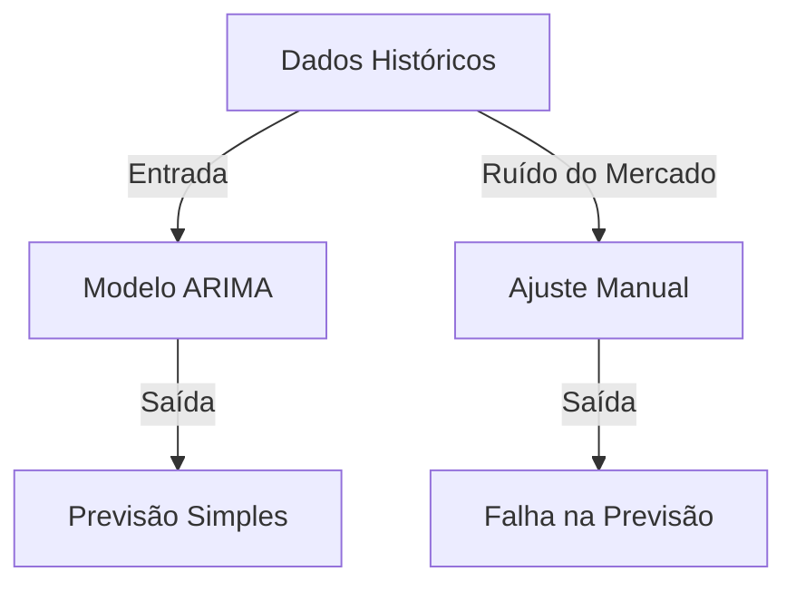

### **1.2. Revolução das Redes Neurais LSTM e Outras Arquiteturas para Previsão de Preços**
As Redes Neurais Recorrentes (RNNs) revolucionaram a modelagem de séries temporais ao permitir a retenção de informações passadas. No entanto, as RNNs tradicionais apresentam o problema do desvanecimento do gradiente, o que limita sua capacidade de capturar dependências de longo prazo.

As redes **Long Short-Term Memory (LSTM)** foram projetadas para resolver esse problema. Elas utilizam células de memória que permitem a manutenção de informações relevantes por períodos prolongados, sendo altamente eficazes na previsão de preços no mercado financeiro.

Além das LSTM, outras arquiteturas também são aplicadas:
- **CNNs (Redes Neurais Convolucionais):** Muito utilizadas para reconhecimento de padrões gráficos nos preços.
- **Transformers:** Modelos modernos que podem lidar com dependências de longo prazo de forma eficiente.
- **Redes Recorrentes Simples:** Menos eficazes devido à perda de informações ao longo do tempo.

**Exemplo:** Um modelo LSTM pode ser treinado com dados históricos de um ativo, aprendendo padrões de alta e baixa para fornecer previsões mais precisas.

**Diagrama Comparativo:**
```mermaid
graph TD;
    A[Entrada (Preços)] -->|Processamento| B[RNN Simples];
    B -->|Saída| C[Previsão Ruim];
    A -->|Processamento| D[LSTM];
    D -->|Saída| E[Previsão Melhor];
```

**Diagrama de Funcionamento do LSTM:**
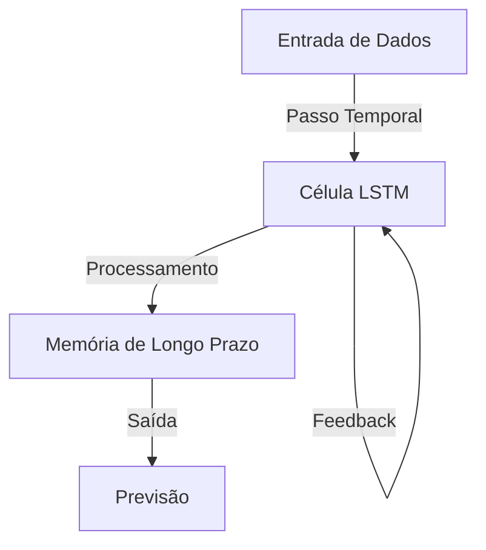

### 📊 **Diagrama Detalhado da Rede Neural**
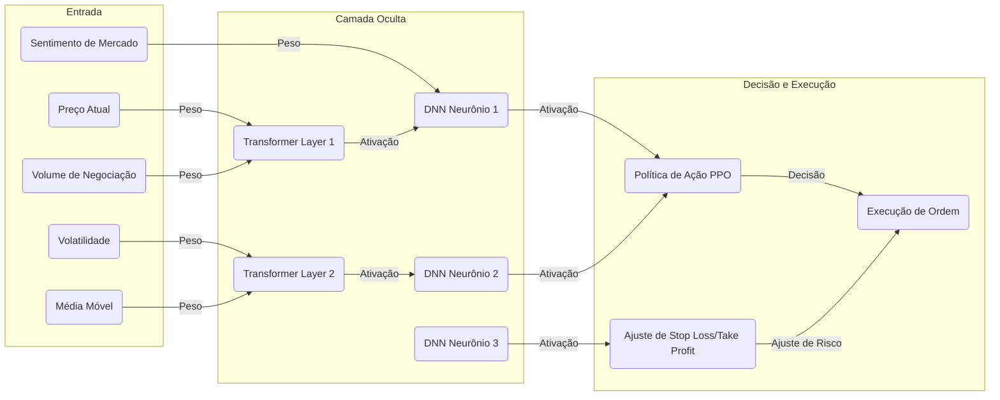

🚀 **Essa arquitetura melhora a capacidade do agente de aprender padrões do mercado e tomar decisões mais assertivas!**

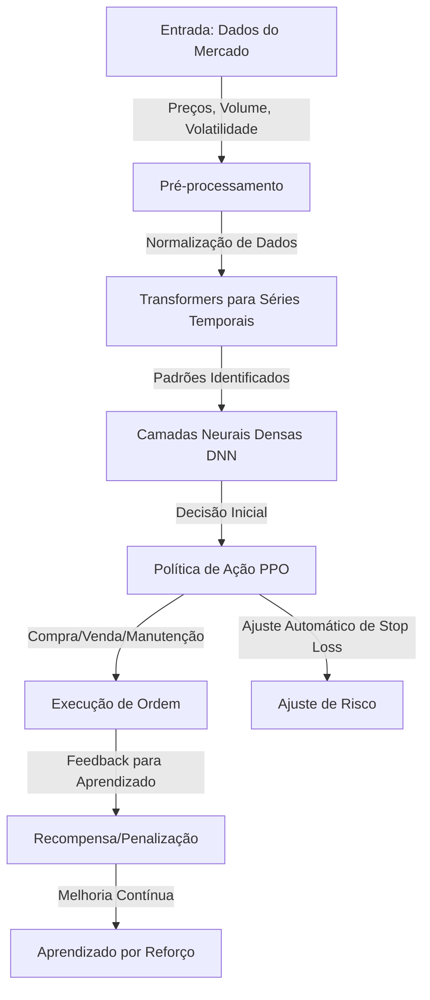

##

### **1.2. Revolução das Redes Neurais LSTM e Outras Arquiteturas para Previsão de Preços**

#### **Por que as LSTM são superiores para séries temporais?**

As **Long Short-Term Memory (LSTM)** são um tipo avançado de Redes Neurais Recorrentes (RNNs) que resolvem o problema do **desvanecimento do gradiente**. Elas mantêm informações relevantes ao longo de várias etapas temporais, utilizando **células de memória** e **portas de controle**, tornando-as ideais para prever preços de ativos financeiros.

**Arquitetura das LSTM:**

1. **Camada de Entrada:** Recebe a sequência temporal de entrada, como preços históricos de ativos.
2. **Célula LSTM:** Contém três portas principais:
   - **Porta de Entrada:** Determina quais novas informações serão armazenadas.
   - **Porta de Esquecimento:** Decide quais informações antigas devem ser descartadas.
   - **Porta de Saída:** Define quais informações processadas serão utilizadas na próxima etapa.
3. **Camada de Saída:** Retorna a previsão do próximo valor da série temporal.

Benefícios das LSTM:
- **Captura de dependências de longo prazo** em séries temporais.
- **Resistência ao desvanecimento do gradiente**, garantindo previsões mais estáveis.
- **Capacidade de aprendizado sequencial**, permitindo identificar padrões temporais ocultos.

**Exemplo Prático:** Imagine que queremos prever o preço de uma ação com base nos últimos 30 dias. A rede LSTM analisará os preços passados e, utilizando suas células de memória, identificará tendências, removendo dados irrelevantes e focando nos padrões mais relevantes para gerar uma previsão precisa.


#### **Exemplos de Redes LSTM**

##### **1. LSTM Simples para Previsão de Preço**
**Explicação:** Essa é uma rede básica composta por duas camadas LSTM empilhadas, seguida por uma camada densa que gera a previsão final. Ideal para previsões de séries temporais simples, como preços de ações.
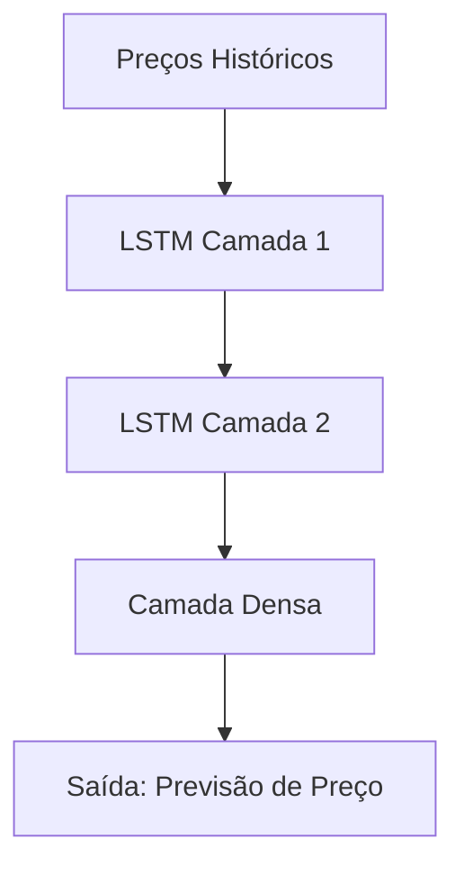

##### **2. LSTM com Múltiplas Entradas**
**Explicação:** Aqui, a rede recebe não apenas preços históricos, mas também outros fatores como volume de negociação e sentimento de mercado. Esses dados são combinados para aumentar a precisão da previsão.
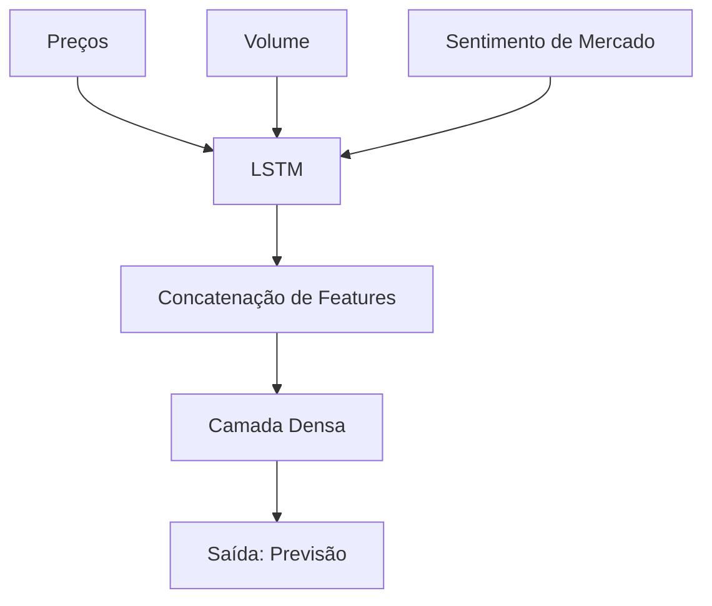

##### **3. Arquitetura Híbrida: CNN + LSTM**
**Explicação:** Essa arquitetura combina CNNs para extrair padrões espaciais dos dados e LSTMs para capturar a dependência temporal. Essa abordagem é útil quando há padrões complexos que exigem análise tanto espacial quanto sequencial.
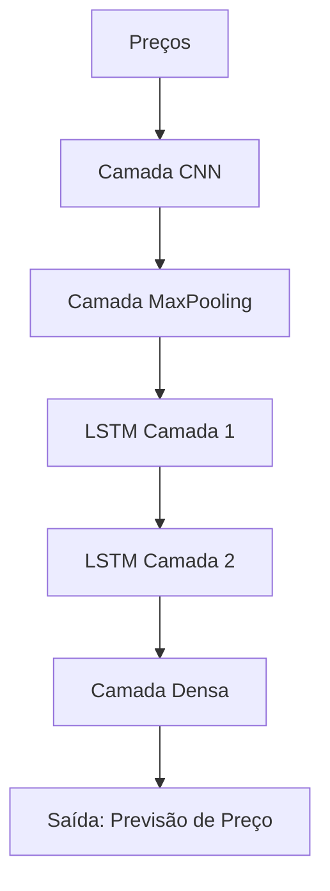

##### **4. LSTM com Mecanismo de Atenção**
**Explicação:** O mecanismo de atenção permite que a rede LSTM se concentre mais em partes importantes da sequência de entrada, melhorando a precisão das previsões ao dar mais peso a eventos significativos.
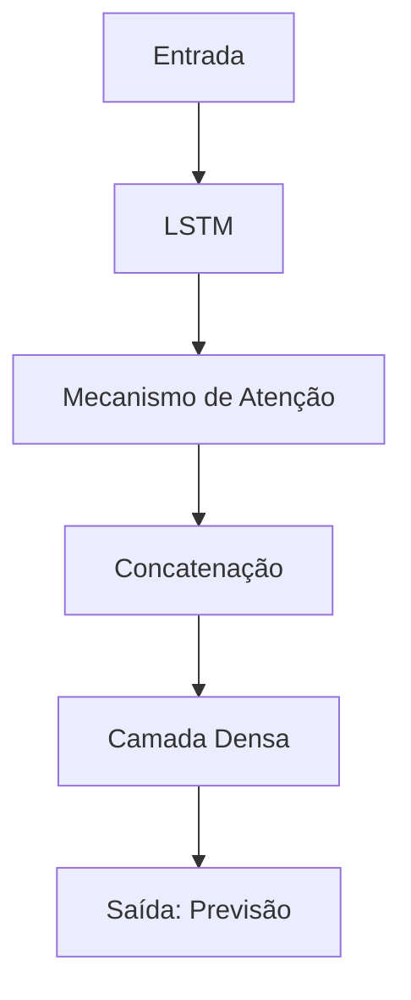

🚀 **A incorporação das LSTM em estratégias de investimento pode proporcionar uma vantagem competitiva significativa para traders e investidores institucionais!**

---
### 1.3. Objetivos Ambiciosos do Projeto

#### 🧠 **Diagrama do Neurônio do Projeto**
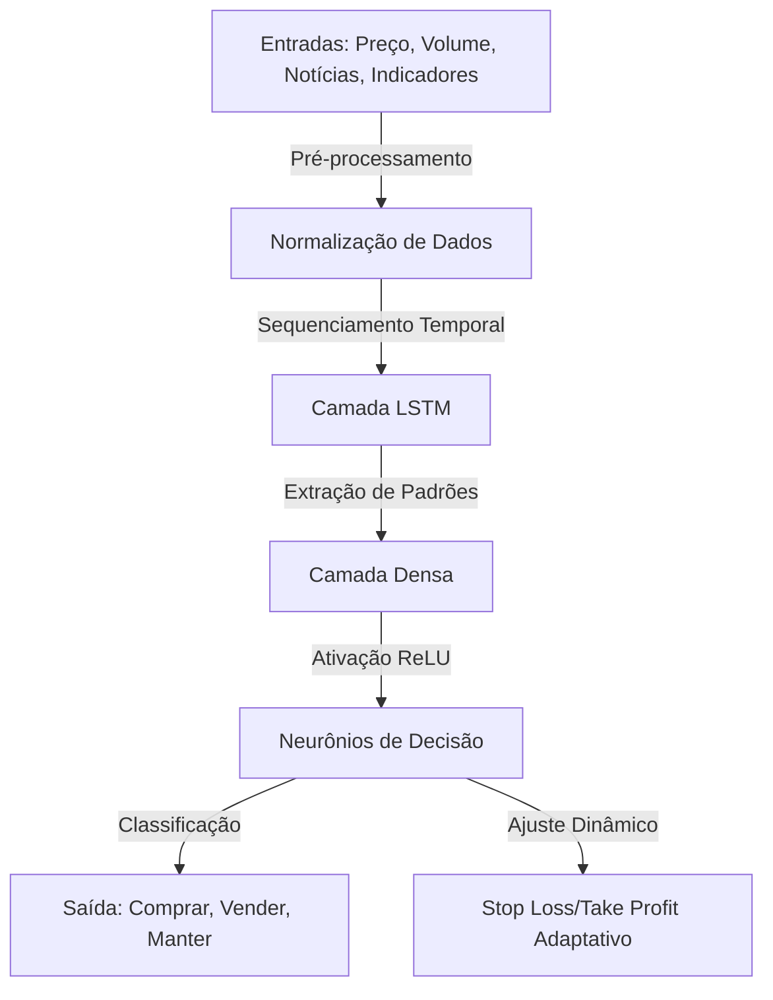

O projeto **Agente Nexo - Investimento Conservador** tem como meta criar um sistema de investimento seguro e eficiente para operar no mercado de futuros BTC/USDT. A ideia principal é permitir que qualquer investidor possa operar de forma automatizada, sem precisar monitorar o mercado o tempo todo.

#### **Principais Objetivos do Projeto:**

1. **Criar um modelo inteligente para prever tendências de preços:**
   - O agente usará um modelo chamado **LSTM**, que aprende com o histórico de preços para prever os próximos movimentos do mercado.
   - **Exemplo:** Se o Bitcoin estiver subindo há vários dias seguidos, o modelo pode sugerir uma venda antecipada antes de uma possível queda.

2. **Automatizar a análise de dados do mercado:**
   - O sistema coletará e analisará os preços de forma contínua, sem precisar de intervenção humana.
   - **Exemplo:** A cada minuto, o agente verifica as informações do mercado e identifica padrões que podem indicar alta ou baixa nos preços.

3. **Ajustar automaticamente as estratégias de compra e venda:**
   - O modelo ajustará **stop loss** (limite de perda) e **take profit** (lucro esperado) conforme o comportamento do mercado.
   - **Exemplo:** Se o preço do Bitcoin começar a cair rapidamente, o agente pode vender antes que a perda seja grande demais.

4. **Reduzir riscos para os investidores:**
   - O sistema evitará operações arriscadas e usará apenas estratégias seguras.
   - **Exemplo:** Se o mercado estiver muito volátil, o agente pode decidir não operar até encontrar uma oportunidade mais estável.

5. **Integrar notícias e sentimento do mercado na análise:**
   - O agente levará em conta notícias e postagens em redes sociais para identificar momentos de otimismo ou pessimismo no mercado.
   - **Exemplo:** Se grandes sites de finanças começarem a relatar más notícias sobre criptomoedas, o agente pode reduzir as compras para evitar perdas.

6. **Executar ordens automaticamente na corretora Nexo:**
   - O agente se conectará à API da corretora para executar operações sem intervenção humana.
   - **Exemplo:** Quando o modelo detectar um sinal de compra forte, ele fará a operação automaticamente na Nexo.

7. **Enviar alertas via Telegram para manter o investidor informado:**
   - O agente notificará o usuário sempre que uma operação importante for realizada.
   - **Exemplo:** O investidor recebe uma mensagem quando o agente compra ou vende Bitcoin, ou quando o mercado muda drasticamente.

8. **Testar estratégias antes de operar no mercado real:**
   - O sistema será testado com dados passados para garantir que a estratégia funciona.
   - **Exemplo:** Se a estratégia for aplicada a dados históricos e mostrar que teria gerado lucro nos últimos meses, ela será validada para uso real.

9. **Melhorar continuamente o desempenho do agente:**
   - O modelo aprenderá com novas informações e se ajustará conforme o mercado evolui.
   - **Exemplo:** Se um novo padrão surgir no mercado, o agente poderá aprender com ele e adaptar suas decisões futuras.

10. **Criar um sistema flexível e escalável:**
    - O agente poderá ser expandido para operar com outros ativos no futuro.
    - **Exemplo:** Se o investidor quiser operar também com Ethereum, o sistema poderá ser ajustado para incluir essa criptomoeda.

---

### **Conclusão**

O **Agente Nexo - Investimento Conservador** busca criar uma ferramenta automatizada e segura para investidores que querem operar no mercado de futuros BTC/USDT sem precisar de monitoramento constante. Através do uso de inteligência artificial, gerenciamento de risco avançado e automação, o agente ajudará investidores a tomar decisões estratégicas e minimizar riscos, tornando o investimento mais seguro e eficiente.

---

## **1.4. Estrutura Completa do Documento** - **Arquitetura do Projeto**

Para dar maior clareza sobre **como** o projeto se integra de ponta a ponta, apresentamos abaixo um **diagrama de arquitetura** que agrupa todas as etapas do **Agente Nexo - Investimento Conservador**: coleta de dados, processamento, treinamento, execução, controle de risco e notificações.

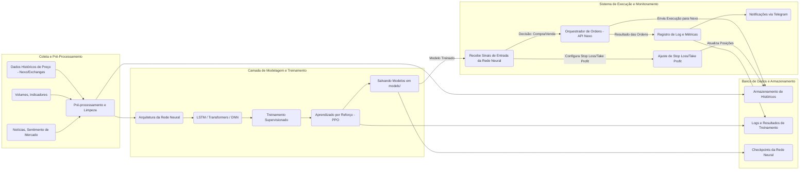

### **Explicação do Fluxo**

1. **Coleta e Pré-Processamento (Bloco A)**  
   - Os dados de preços, volumes, indicadores técnicos e até sentimentos de mercado (notícias/tweets) passam por um processo de limpeza e formatação. Em seguida, são armazenados para uso posterior no treinamento.

2. **Camada de Modelagem e Treinamento (Bloco B)**  
   - Aqui temos a **arquitetura de rede neural** (p. ex. LSTM, Transformers, DNN) e as técnicas de **Aprendizado por Reforço** (PPO) para refinar a estratégia de trading.
   - Os modelos treinados são salvos em `models/`, ficando prontos para uso na tomada de decisão.

3. **Sistema de Execução e Monitoramento (Bloco C)**  
   - Recebe **sinais de compra/venda** do modelo treinado e faz os ajustes automáticos de **stop loss** e **take profit**.
   - Conecta-se à **API da Nexo** para abrir, fechar ou atualizar posições de forma automática e segura.
   - Gera logs de cada operação, registra métricas de desempenho e envia alertas via **Telegram**.

4. **Banco de Dados e Armazenamento (Bloco D)**  
   - **Armazena** todo o histórico de preços coletado, as métricas de treinamento (logs) e **checkpoints** dos modelos.
   - Facilita **backtesting** e auditoria do sistema, além de servir de base para o aprimoramento contínuo.

---

### **Onde cada capítulo do Documento se encaixa nessa Arquitetura**

- **Capítulo 1 (Visão Geral):** Contextualiza o desafio do mercado financeiro, a relevância das LSTM/Transformers e define os objetivos de um sistema de investimento conservador.  
- **Capítulo 2 (Fundamentos Teóricos):** Apresenta os diferentes tipos de redes neurais e métodos estatísticos que embasam o bloco B (Modelagem/Aprendizado).  
- **Capítulo 3 (Engenharia de Dados):** Refere-se diretamente ao bloco A, descrevendo as fontes de dados, como limpá-los e tratá-los para alimentação do modelo.  
- **Capítulo 4 (Arquitetura da Rede LSTM):** Desdobra a parte crucial do bloco B, mostrando a criação das camadas LSTM, CNN ou Transformers, bem como as escolhas de hiperparâmetros.  
- **Capítulo 5 (Predição e Validação):** Foca nas etapas de teste rigoroso e backtesting do sistema (ainda dentro do bloco B, mas também registrando no bloco D).  
- **Capítulo 6 (Integração com Trading):** Conecta o bloco B ao bloco C (Execução), detalhando como as previsões viram ordens automáticas, gerando logs e alertas.  
- **Capítulo 7 (Considerações Finais):** Avalia resultados, mostra as conquistas e expande possibilidades para melhorar a arquitetura (ex.: novas features, mais fontes de dados).  
- **Capítulo 8 (Recursos Avançados):** Indica bibliotecas, frameworks e leituras que podem complementar tanto a camada de dados quanto a de modelagem, além de redes de apoio na comunidade.

---

#### **Com esse diagrama e explicação, a "arquitetura do projeto" se torna visível** dentro do item **"1.4. Estrutura Completa do Documento"**, dando sustentação prática a cada capítulo e seção apresentados.

---

## **Capítulo 2: Fundamentos Teóricos Profundos**

### **2.1. Redes Neurais Recorrentes vs. LSTM: Um Combate Técnico**
- **RNN (Redes Neurais Recorrentes Tradicionais):** Capacidade de processar sequências, mas sofre com o problema do desaparecimento do gradiente.
- **LSTM (Long Short-Term Memory):** Introduz mecanismos de memória mais eficientes, permitindo aprendizado de dependências longas.
- **GRU (Gated Recurrent Units):** Variante simplificada da LSTM, menos computacionalmente custosa.

### **2.2. Outras Arquiteturas de Redes Neurais para Previsão de Preços**
- **Redes Neurais Convolucionais (CNNs)**
  - Excelentes para detectar padrões em dados estruturados.
  - Aplicáveis a séries temporais quando combinadas com LSTM.
  - Extração automática de características úteis dos preços históricos.
  
- **Transformers**
  - Utilizados em modelos como BERT e GPT, podem processar longas sequências sem perder contexto.
  - Aplicação crescente em finanças, porém mais custoso em termos computacionais.

- **Modelos Híbridos**
  - Integração de CNNs para feature extraction, LSTM para sequência temporal e Transformers para análise contextual avançada.
  - Pode oferecer previsões mais robustas ao combinar as vantagens de cada abordagem.

- **Por que escolhemos LSTM?**
  - Maior capacidade de captura de padrões temporais em dados financeiros.
  - Menor custo computacional em relação a Transformers.
  - Melhor interpretabilidade do modelo em comparação com redes puramente convolucionais.

### **2.3. Inteligência Financeira Aplicada**
- Como o mercado reage a diferentes eventos?

### **Impacto de Notícias e Análise de Sentimento**
- **Como notícias afetam o mercado financeiro?**
  - Eventos políticos e econômicos podem causar grandes variações nos preços de ativos.
  - Notícias inesperadas, como falências ou aquisições, impactam diretamente o comportamento dos investidores.

- **Medição do Sentimento do Mercado**
  - Uso de processamento de linguagem natural (NLP) para extrair sentimentos de manchetes e redes sociais.
  - Indicadores como Índice de Medo e Ganância (Fear and Greed Index) podem ajudar a interpretar emoções coletivas dos investidores.

- **Fontes de Dados para Análise de Sentimento**
  - Coleta de dados via APIs como Twitter, Google Trends e notícias financeiras.
  - Métodos de análise textual para determinar polaridade e emoção das informações.

- **Implementação da Análise de Sentimento em Modelos de Previsão**
  - Integração de variáveis de sentimento com dados de séries temporais.
  - Teste da correlação entre sentimento público e movimentação dos preços.
  - Ajuste do modelo para reagir de forma mais eficiente a mudanças abruptas de sentimento.

---

### **2.4. Estatísticas e Métodos para Melhorar as Previsões**

Para fazer previsões mais precisas, é essencial entender alguns conceitos estatísticos e técnicas que ajudam a interpretar os dados corretamente. Aqui estão algumas das principais abordagens utilizadas:

#### **Analisando Tendências e Padrões no Tempo**
- O objetivo principal de prever preços é identificar padrões no comportamento passado dos ativos e projetá-los para o futuro.
- Algumas técnicas comuns incluem **médias móveis** (que suavizam as variações diárias para identificar tendências) e **suavização exponencial** (que dá mais peso aos valores recentes, tornando a previsão mais responsiva às mudanças).

#### **Medição da Qualidade das Previsões**
- Para saber se um modelo está funcionando bem, precisamos medir o quão próximas estão as previsões dos valores reais.
- Algumas formas de avaliar isso incluem:
  - **Erro Quadrático Médio (MSE)**: Mede o tamanho médio do erro, dando mais peso aos erros maiores.
  - **Erro Médio Absoluto (MAE)**: Indica, em média, o quão distante a previsão está do valor real.
  - **Coeficiente de Determinação (R²)**: Indica o quão bem o modelo consegue explicar a variação dos preços.

Aqui está uma versão mais simples e intuitiva desse trecho:  

---

### **Entendendo Relações entre os Dados**  

Os preços dos ativos não se movimentam de forma completamente aleatória. Muitas vezes, eles seguem certos padrões que podem se repetir ao longo do tempo.  

- Por exemplo, um ativo pode subir toda vez que há um aumento na demanda ou cair em períodos de incerteza no mercado.  
- Para descobrir esses padrões, analisamos se os preços passados influenciam os preços futuros.  
- Muitas vezes, os preços de ativos seguem ciclos ou padrões sazonais.
  Ferramentas como
  **ACF (Autocorrelation Function)** 
  **PACF (Partial Autocorrelation Function)**
  ajudam a entender se há relações entre preços passados e futuros.

---

#### **ACF e PACF: Como Entender a Relação Entre os Preços Passados e Futuros**  

Quando tentamos prever os preços de um ativo, precisamos entender como os valores anteriores influenciam os próximos. Para isso, usamos dois métodos importantes:  

##### **1. ACF (Função de Autocorrelação)**  
- A ACF mede o quanto os preços passados estão relacionados com os preços futuros.  
- Por exemplo, se o preço de uma ação hoje for muito parecido com o de ontem e de anteontem, há uma forte autocorrelação.  
- Isso significa que o comportamento recente pode ser útil para prever os próximos valores.  

💡 **Exemplo prático:** Se o preço do ouro sobe por três dias seguidos, pode ser que ele tenha uma tendência de continuar subindo, e a ACF ajudaria a medir essa relação.  

##### **2. PACF (Função de Autocorrelação Parcial)**  
- A PACF é parecida com a ACF, mas ela mede apenas a relação direta entre um preço e um dia específico no passado, ignorando influências intermediárias.  
- Isso ajuda a descobrir quais períodos passados realmente influenciam os preços futuros, sem que a análise seja distorcida por efeitos acumulados.  

💡 **Exemplo prático:** Se o preço de uma ação hoje está fortemente ligado ao preço de três dias atrás, mas não é afetado pelos preços intermediários, a PACF mostrará essa relação direta.  

---

#### **Por que isso é importante?**  
- ACF e PACF ajudam a identificar quais períodos passados são realmente importantes para prever os próximos preços.  
- Essas informações são essenciais para escolher o melhor modelo de previsão e evitar erros ao tentar encontrar padrões que não existem.  

---

- Isso permite ajustar o modelo para capturar melhor essas tendências.

#### **Testando a Confiabilidade dos Dados**
- Antes de aplicar um modelo, é importante verificar se os dados são adequados para previsão. Dois testes estatísticos úteis são:
  - **Teste de Dickey-Fuller Aumentado (ADF)**: Verifica se os preços têm uma tendência persistente ou se são mais aleatórios.
  - **Teste de Ljung-Box**: Avalia se há padrões previsíveis nos erros do modelo.

#### **Preparando os Dados para Melhor Desempenho**
- Modelos de inteligência artificial funcionam melhor quando os dados estão bem organizados. Duas formas comuns de preparar os dados são:
  - **Normalização (MinMax Scaling)**: Ajusta os valores para um intervalo fixo, como 0 a 1, facilitando a aprendizagem da rede neural.
  - **Padronização (Z-score normalization)**: Transforma os dados para que tenham média zero e desvio padrão 1, ajudando modelos que dependem da distribuição dos valores.

---

## **Capítulo 3: Engenharia de Dados Avançada**
### **3.1. Fontes de Dados de Alta Qualidade**
- APIs para dados financeiros (Alpha Vantage, Yahoo Finance, Binance).
- Extração e manipulação de grandes volumes de dados.

### **3.2. Pré-processamento Estratégico**
- Criação de features derivadas para melhor desempenho.
- Filtragem de ruído e detecção de anomalias.

### **3.3. Construção de um Dataset Aprimorado**
- Técnicas avançadas de normalização e transformação.
- Amostragem inteligente para treinamento equilibrado.

---

## **Capítulo 4: Arquitetura Otimizada da Rede LSTM**
### **4.1. Design da Arquitetura Neural**
- Stack de múltiplas camadas LSTM.
- Regularização com Dropout e Batch Normalization.
- Comparação com outras abordagens arquitetônicas.

### **4.2. Implementação Profissional**
- Estrutura modular em Python.
- Código limpo e escalável.

### **4.3. Aprimoramento Contínuo**
- Treinamento dinâmico com técnicas de Transfer Learning.
- Monitoramento do desempenho e ajustes automáticos.

---

## **Capítulo 5: Predição e Validação de Resultados**
### **5.1. Testes Rigorosos com Dados Reais**
- Estratégia de validação cruzada.
- Simulações em cenários distintos do mercado.

### **5.2. Visualizações Impressionantes**
- Gráficos interativos para insights estratégicos.
- Comparação de previsões vs. preços reais.

### **5.3. Otimização Baseada em Feedback Contínuo**
- Ajustes automáticos conforme o mercado evolui.

---

## **Capítulo 6: Integração com Estratégias de Trading**
### **6.1. Transformando Previsões em Lucros**
- Como usar previsões para operações automatizadas.
- Modelos de risco e recompensa.

### **6.2. Backtesting e Testes de Robustez**
- Avaliação de performance em condições adversas.

### **6.3. Implementação de Algoritmos de Execução**
- Conectando o modelo a corretoras e APIs de trading.

---

## **Capítulo 7: Considerações Finais e Futuro do Projeto**
### **7.1. O que foi alcançado?**
### **7.2. Novos Caminhos para Expansão**
- Testes com Transformers e modelos híbridos.
- Aplicação em diferentes classes de ativos.

### **7.3. Como Contribuir e Evoluir o Projeto**

---

## **Capítulo 8: Recursos Avançados**
### **8.1. Leituras Recomendadas**
- Artigos acadêmicos e papers sobre LSTM, CNNs e Transformers para mercado financeiro.

### **8.2. Ferramentas e Tecnologias de Ponta**
- Bibliotecas, frameworks e ambientes de desenvolvimento.

### **8.3. Comunidade e Fóruns para Networking**
- Como aprender e trocar conhecimento com especialistas.

---

```bash
# =======================================================================
# AGENTE NEXO - INVESTIMENTO CONSERVADOR
# =======================================================================
# Modo CLI Ativado: Apresentando Resposta em Markdown + Estilo de Linha de Comando
# =======================================================================

Bem-vindo! A seguir, apresento um resumo rápido (macro) e depois um detalhamento interno (micro) do projeto **Agente Nexo - Investimento Conservador**, conforme solicitado.

[Digite "enter" para continuar...]
```

## :telescope: **Visão Macro do Projeto**

O diagrama macro exibe **todo o fluxo**: desde a coleta e pré-processamento dos dados, passando pelo treinamento de modelos, até a execução das operações na Nexo e notificação via Telegram.

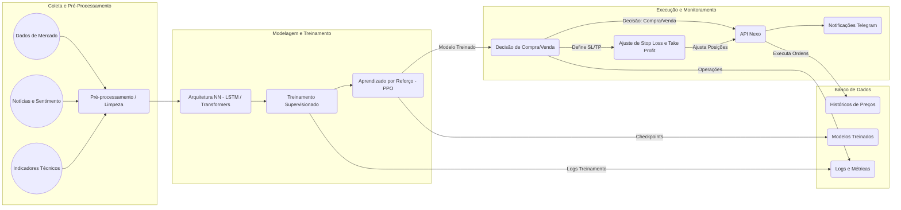

### **Explicação Rápida (Macro)**

1. **Coleta de Dados**: O sistema busca preços, volumes, indicadores e notícias do mercado.  
2. **Pré-processamento**: Os dados são limpos, normalizados e transformados.  
3. **Modelagem / Treinamento**:  
   - **Rede Neural (LSTM/Transformers)** aprende padrões.  
   - **Aprendizado por Reforço (PPO)** refina a estratégia de trading.  
4. **Execução**: O modelo envia **ordens de compra/venda** para a plataforma Nexo, com ajuste automático de **Stop Loss** e **Take Profit**.  
5. **Notificação**: Todas as ações são enviadas por Telegram para manter o investidor informado.  
6. **Banco de Dados**: Todos os históricos, logs de treinamento e modelos treinados são armazenados para consultas futuras.

```bash
# Pressione ENTER para ver o Desenho Micro
```

## :microscope: **Visão Micro do Projeto**

Agora, observamos um **detalhamento interno** de como o **Agente** toma suas decisões minuto a minuto, usando módulos de rede neural, aprendizado por reforço e gerenciamento de risco.

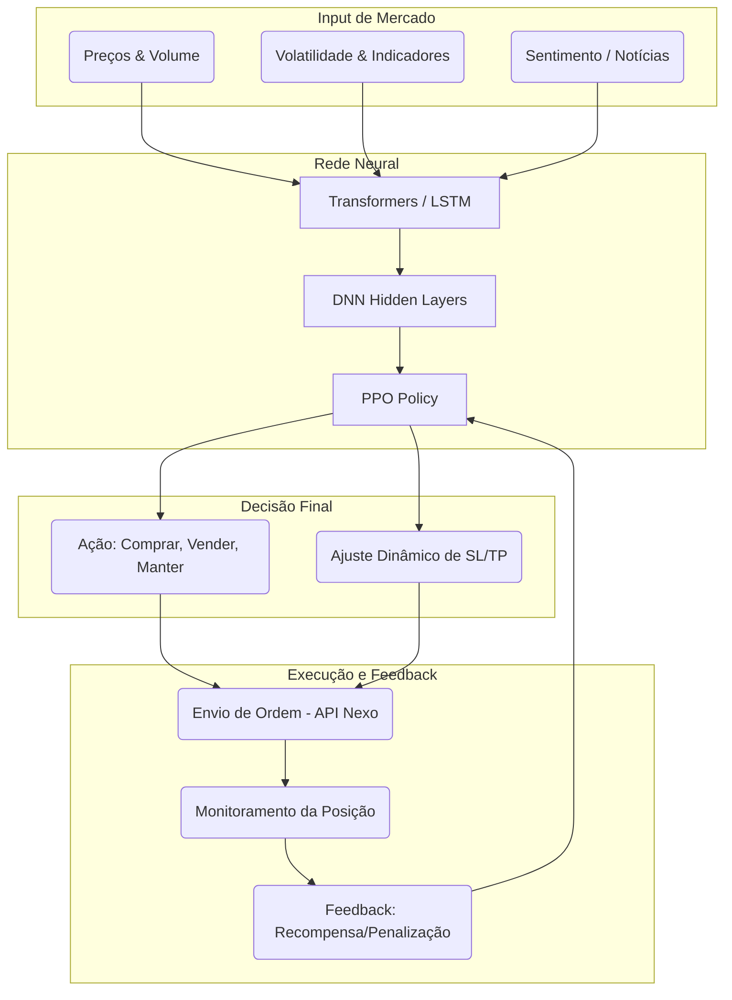

### **Explicação Rápida (Micro)**

1. **Input de Mercado**: Preços, volume, volatilidade e dados de sentimento são capturados continuamente.  
2. **Rede Neural**:  
   - Módulo **Transformers ou LSTM** detecta padrões temporais complexos.  
   - Camadas densas (**DNN**) refinam a análise, combinando múltiplas variáveis.  
   - **PPO (Aprendizado por Reforço)** recebe feedback (recompensa/penalização) e ajusta a política de ação.  
3. **Decisão Final**:  
   - **Comprar, Vender ou Manter** a posição.  
   - **Ajustar Stop Loss e Take Profit** dinamicamente, conforme risco e volatilidade.  
4. **Execução**: As ordens são enviadas para a Nexo, e o agente **monitora** em tempo real.  
5. **Feedback**: O resultado (lucro, prejuízo ou neutralidade) retorna para o PPO, melhorando as futuras decisões.

---

## Treinamento

```bash
┌─────────────────────────────────────────────────────────────────────────┐
│              AGENTE NEXO - SESSÃO DE TREINAMENTO DA REDE NEURAL        │
└─────────────────────────────────────────────────────────────────────────┘

Bem-vindo à sessão focada no **treinamento da rede neural** do Agente Nexo e na definição dos “jogos” (cenários) para aprimorar nosso modelo de investimento conservador.

Por favor, selecione uma das opções abaixo para navegar no sistema:

1. [Definição dos Cenários de Treinamento ("Jogos")]
2. [Método de Seleção dos Melhores Indivíduos (Modelos)]
3. [Retornar ao Menu Principal]

Digite o número desejado e pressione ENTER:
```

### **1) Definição dos Cenários de Treinamento ("Jogos")  

```bash
$ opçao_selecionada = 1
> Carregando cenários de treinamento ...
```
A ideia é submeter o Agente Nexo a diferentes **jogos** ou **cenários de mercado**, permitindo que ele aprenda a tomar decisões assertivas em condições variadas. Cada jogo gera recompensas (positivas) e penalizações (negativas), ajustando o comportamento do agente via **Aprendizado por Reforço**.

**Jogos Principais:**

1. **Mercado de Baixa Extrema (Bear Market)**
   - **Cenário:** O mercado cai ~10% em curto período.  
   - **Objetivo:** Ensinar o agente a **evitar perdas** excessivas e encontrar um ponto de entrada seguro.  
   - **Recompensa:** Protege o capital e identifica recuperação.  

2. **Mercado Lateral (Consolidação)**
   - **Cenário:** Preço oscila em uma faixa estreita, sem tendência definida.  
   - **Objetivo:** Explorar **comprar no fundo e vender no topo** dentro da faixa, evitando overtrading.  
   - **Recompensa:** Precisão nas entradas e saídas dentro do canal.  

3. **Pump & Dump (Volatilidade Extrema)**
   - **Cenário:** O preço do BTC/USDT dispara rapidamente (+15%), mas despenca em seguida (-20%).  
   - **Objetivo:** Ensinar o agente a **entrar no momento certo** ou **evitar o topo** para não ser pego na queda.  
   - **Recompensa:** Capturar parte do pump e sair antes do dump.  

4. **Notícias Impactantes**
   - **Cenário:** Surge uma notícia que afeta o sentimento do mercado (positivo ou negativo).  
   - **Objetivo:** Reagir de forma rápida ao novo fluxo de informação, evitando **armadilhas** quando o movimento for apenas “ruído” ou aproveitando uma **mudança real de tendência**.  
   - **Recompensa:** Ajustar posições conforme a notícia; se a ação for coerente, o agente recebe alta pontuação.  

5. **Flash Crash (Queda Rápida e Recuperação)**
   - **Cenário:** O BTC cai muito rápido (10%) e retoma a maior parte da queda (8%) em seguida.  
   - **Objetivo:** Não “despejar tudo” no pânico e aproveitar preços descontados.  
   - **Recompensa:** Se o agente conseguir **comprar no fundo** e lucrar com a recuperação, ganha pontuação elevada.  

Esses cenários simulam situações críticas e testam a **robustez da rede neural**. É por meio desses “jogos” que o Agente Nexo aprende **estratégias vencedoras** e aptas a se adaptar ao mundo real.

---

### **2) Método de Seleção dos Melhores Indivíduos (Modelos)**  

```bash
$ opçao_selecionada = 2
> Carregando critérios de seleção ...
```
Após rodar as simulações nos diversos jogos, teremos **vários agentes/indivíduos** treinados, cada qual com parâmetros e políticas de ação distintas. Para escolher o(s) melhor(es) modelo(s), adotamos métricas de performance e estabilidade:

1. **Métrica de Retorno vs. Risco**  
   - **Sharpe Ratio**: Mede a relação entre retorno e volatilidade das operações.  
   - **Sortino Ratio**: Foca no risco de queda (drawdown), punindo operações muito arriscadas.

2. **Drawdown Máximo (Max Drawdown)**  
   - Verifica a maior perda durante o período de simulação.  
   - Modelos com drawdown muito alto podem ser excluídos, pois **não são conservadores**.  

3. **Estabilidade de Lucro ao Longo do Tempo**  
   - Avalia se o agente mantém desempenho consistente em diversos cenários ou se só foi bem em um cenário específico.

4. **Precisão e Taxa de Acerto**  
   - Verifica a quantidade de operações bem-sucedidas vs. total de trades.  
   - **Importante**: Uma alta taxa de acerto sozinha não basta; é necessário equilibrar **risco x retorno**.  

5. **Critério de Consistência em Múltiplos Jogos**  
   - O agente é posto à prova nos 5 cenários acima.  
   - **Pontos Extras** para quem mantiver bom desempenho em todos os cenários, evitando ser muito “especialista” em apenas um tipo de mercado.  

> **Observação**: Ao final de cada fase de treinamento, apenas os indivíduos/melhores checkpoints que **atendem aos critérios de risco e retorno** são preservados no repositório. Isso garante a evolução contínua do Agente Nexo rumo a estratégias cada vez mais **estáveis e conservadoras**.

---

### **3) Retornar ao Menu Principal**  

```bash
$ opçao_selecionada = 3
> Encerrando a sessão de treinamento da rede neural. Retornando ao menu...
```

**Sessão Finalizada.**  
Use este guia para conduzir seus experimentos de treinamento, definir cenários de teste (“jogos”) e selecionar os melhores indivíduos (modelos) com base em métricas de **risco** e **retorno**. Assim, garantimos uma estratégia conservadora e robusta para o Agente Nexo.

---

## 📌 Sumário
- [Introdução](#introdução)
- [Objetivos](#objetivos)
- [Como Funciona](#como-funciona)
- [Tecnologias Usadas](#tecnologias-usadas)
- [Instalação](#instalação)
- [Configuração do Agente](#configuração-do-agente)
- [Execução](#execução)
- [Rede Neural e Treinamento](#rede-neural-e-treinamento)
- [Pipeline CI/CD](#pipeline-cicd)
- [Contribuições](#contribuições)
- [Licença](#licença)

---

## 🏁 Introdução

O mercado de criptomoedas muda muito rápido. Este agente usa **inteligência artificial** para analisar os preços do BTC/USDT e decidir automaticamente **quando comprar e quando vender**. Ele sempre busca uma estratégia segura, mantendo o risco baixo. 

Agora, com **notificações via Telegram**, você pode receber mensagens sobre **novas operações**, **ajustes de limite**, **ordens executadas** e **alertas importantes** diretamente no seu celular. 📲

---

## 🎯 Objetivos
✔️ Operar no mercado de futuros BTC/USDT na Nexo.  
✔️ Ajustar **stop loss** e **take profit** automaticamente.  
✔️ Aplicar uma **estratégia segura** para evitar grandes perdas.  
✔️ Controlar **alavancagem** para evitar riscos desnecessários.  
✔️ **Enviar notificações via Telegram** para monitoramento em tempo real.  

---

## 🤖 Como Funciona

O agente usa **inteligência artificial** para analisar o mercado e decidir o melhor momento para comprar ou vender BTC. Ele utiliza uma **rede neural avançada**, que aprende com dados passados para melhorar as decisões futuras.

- **Transformers para analisar padrões de preços** 📈
- **Rede Neural para processar dados do mercado** 🔍
- **Sistema de recompensas para aprender boas estratégias** 🎯

A cada minuto, o agente:
1. Coleta os preços mais recentes do BTC/USDT.
2. Analisa as tendências e padrões do mercado.
3. Ajusta os limites de **stop loss** e **take profit**.
4. Toma decisões sobre **comprar ou vender**.
5. Envia alertas no Telegram com informações importantes.

---

## 🛠️ Tecnologias Usadas
- **Python** 🐍
- **Bibliotecas:**
  - `tensorflow`, `keras` → Rede neural 🧠
  - `transformers` → Análise de padrões 🔎
  - `stable-baselines3` → Aprendizado por reforço 📊
  - `requests` → Comunicação com a API da Nexo 🔗
  - `pandas`, `numpy` → Processamento de dados 📉
  - `schedule` → Execução automática ⏳
  - `telepot` → Notificações no Telegram 📩

---

## 📚 Rede Neural e Treinamento

A **rede neural** do agente é composta por **três módulos principais**:

### 🧠 Arquitetura da Rede Neural
1. **Módulo de Entrada**: Processa os dados do mercado, incluindo preços, volume e volatilidade.
2. **Módulo de Processamento**: Usa **Transformers** para detectar padrões em séries temporais e redes neurais profundas (**DNN**) para refinar a análise dos dados.
3. **Módulo de Decisão**: Implementa **Aprendizado por Reforço Profundo (PPO - Proximal Policy Optimization)** para ajustar automaticamente a estratégia de trading.

### 🔄 Fluxo de Treinamento
1. **Coleta de dados** 📊: Obtém preços do BTC, volume de negociação e outras informações do mercado.
2. **Pré-processamento** 🔍: Filtra dados e remove informações irrelevantes.
3. **Treinamento supervisionado** 🎓: Aprende padrões de comportamento a partir de dados passados.
4. **Treinamento por Reforço (PPO)** 🏆: Testa diferentes estratégias e aprende quais funcionam melhor.
5. **Backtesting** 🔄: Simula operações para ver como o modelo se sairia em diferentes cenários.
6. **Ajustes contínuos** 📈: O agente melhora ao longo do tempo, adaptando-se ao mercado.

### 📊 Diagrama Detalhado da Rede Neural


🚀 **Essa arquitetura melhora a capacidade do agente de aprender padrões do mercado e tomar decisões mais assertivas!**


---

🚀 **Com essa arquitetura, o agente pode aprender com o mercado, detectar padrões mais rapidamente e melhorar suas decisões ao longo do tempo!**

---

# 📈 Training Scenarios for Agente Nexo

## 🏆 Objetivo
Este documento define diferentes **cenários de treinamento** para o agente Nexo, permitindo que ele aprenda a tomar **decisões de investimento** da melhor forma possível em **diferentes condições de mercado**.

O treinamento será dividido em **jogos/simulações**, onde o agente enfrentará desafios e aprenderá **estratégias vencedoras**.

---

## 🎮 Jogos e Cenários de Treinamento

### **1️⃣ Jogo: Mercado de Baixa Extrema (Bear Market)**
🔹 **Objetivo:** Ensinar o agente a **evitar perdas** e identificar pontos de entrada seguros.
🔹 **Cenário:**
   - O mercado cai 10% em um curto período.
   - O agente precisa decidir se **mantém a posição, vende ou espera**.
   - Se ele vender muito cedo, pode perder um possível repique.
   - Se ele segurar muito tempo, pode sofrer grandes perdas.
🔹 **Recompensa:**
   - Se evitar perdas acima de 5% e encontrar um **ponto de entrada lucrativo**, recebe uma **recompensa alta**.
   - Se segurar demais e não conseguir recuperar, recebe **penalização**.

### **2️⃣ Jogo: Mercado Lateral (Consolidação)**
🔹 **Objetivo:** Ensinar o agente a operar em **mercados sem tendência**.
🔹 **Cenário:**
   - O preço oscila entre 40.000 e 42.000 USDT.
   - O agente deve aprender a **comprar na parte inferior e vender na parte superior**.
   - Se ele operar fora dessas faixas, pode sofrer **prejuízos desnecessários**.
🔹 **Recompensa:**
   - Se fizer **entradas e saídas precisas dentro da faixa**, recebe **recompensa alta**.
   - Se comprar ou vender nos momentos errados, recebe **penalização**.

### **3️⃣ Jogo: Pump & Dump (Volatilidade Extrema)**
🔹 **Objetivo:** Ensinar o agente a **evitar armadilhas e capturar movimentos rápidos**.
🔹 **Cenário:**
   - O mercado sobe rapidamente 15% e depois cai 20%.
   - O agente precisa decidir **se entra na alta ou espera uma correção**.
🔹 **Recompensa:**
   - Se identificar corretamente um **ponto de entrada seguro**, recebe **recompensa**.
   - Se entrar muito tarde e sofrer perdas com a correção, recebe **penalização**.

### **4️⃣ Jogo: Notícias Impactantes**
🔹 **Objetivo:** Ensinar o agente a **adaptar-se a eventos inesperados**.
🔹 **Cenário:**
   - Uma **notícia impactante** surge, alterando o sentimento do mercado.
   - O agente deve identificar se a notícia **gera uma nova tendência ou apenas ruído**.
🔹 **Recompensa:**
   - Se ajustar sua estratégia corretamente de acordo com a **notícia**, recebe **recompensa alta**.
   - Se entrar cedo demais ou ignorar o impacto real, recebe **penalização**.

### **5️⃣ Jogo: Flash Crash (Queda Rápida e Recuperação)**
🔹 **Objetivo:** Ensinar o agente a **reagir rapidamente e identificar oportunidades**.
🔹 **Cenário:**
   - O BTC despenca 10% em minutos, mas recupera 8% logo depois.
   - O agente precisa aprender a **não vender no pânico** e procurar oportunidades de compra.
🔹 **Recompensa:**
   - Se conseguir **comprar no momento certo**, recebe **recompensa alta**.
   - Se vender no fundo por medo, recebe **penalização**.

---

## 🧠 Como o Agente Aprende a Melhor Estratégia?

1. **Simulações Massivas**
   - O agente é testado **milhares de vezes** em cada cenário.
   - Cada simulação ajusta os pesos da rede neural para **evitar erros futuros**.

2. **Recompensa por Decisões Certas**
   - O modelo de aprendizado por reforço **recompensa boas decisões** e **penaliza erros**.
   - Cada jogo reforça **padrões de comportamento eficiente**.

3. **Ajustes Contínuos**
   - Após o treinamento inicial, o agente continua aprendendo **com o mercado ao vivo**.
   - Se um novo padrão de mercado surgir, o agente pode **se adaptar automaticamente**.

---

🚀 **Com esses jogos de treinamento, o agente poderá operar de forma mais inteligente e segura no mercado de futuros BTC/USDT!**


---

## 1. Estrutura do Projeto
```
nexo_futures_ai/
│-- data/                # Armazena dados brutos e processados
│-- models/              # Modelos treinados e checkpoints
│-- scripts/             # Scripts de execução rápida
│-- notebooks/           # Notebooks para exploração de dados e testes
│-- configs/             # Configurações do projeto
│-- logs/                # Logs de execução e treinamento
│-- src/                 # Código-fonte principal
│   │-- __init__.py      # Torna 'src' um pacote Python
│   │-- data_loader.py   # Carrega e processa os dados
│   │-- model.py         # Define a rede neural
│   │-- train.py         # Script de treinamento do modelo
│   │-- evaluate.py      # Avalia o modelo treinado
│   │-- utils.py         # Funções auxiliares
│-- README.md            # Documentação do projeto
│-- .gitignore           # Arquivos a serem ignorados pelo Git
│-- requirements.txt     # Lista de dependências do projeto
│-- configs/config.yaml  # Arquivo de configuração
```

## 2. Explicação de Cada Arquivo

### Diretórios:
- **data/**: Armazena os dados brutos (ex: histórico de preços) e os dados processados.
- **models/**: Guarda os modelos treinados e checkpoints para futuras execuções.
- **scripts/**: Scripts utilitários que podem ser rodados separadamente.
- **notebooks/**: Contém Jupyter Notebooks para análise e testes interativos.
- **configs/**: Armazena arquivos de configuração para parametrização do projeto.
- **logs/**: Contém arquivos de log gerados durante execuções do treinamento e testes.
- **src/**: Contém o código-fonte principal do projeto.

### Arquivos:
- **README.md**: Explica o objetivo do projeto, como rodá-lo e suas dependências.
- **.gitignore**: Arquivo que informa ao Git quais arquivos e pastas devem ser ignorados no versionamento.
- **requirements.txt**: Lista todas as dependências (bibliotecas) que o projeto precisa para rodar corretamente.
- **configs/config.yaml**: Define configurações do projeto, como hiperparâmetros e caminhos dos dados.

### Arquivos em `src/`:
- **__init__.py**: Torna a pasta um pacote Python, permitindo importação de módulos.
- **data_loader.py**: Contém funções para carregar, limpar e processar os dados de entrada.
- **model.py**: Define a arquitetura da rede neural (ex: LSTM, CNN, MLP).
- **train.py**: Responsável por treinar o modelo usando os dados de entrada.
- **evaluate.py**: Mede o desempenho do modelo treinado usando métricas de avaliação.
- **utils.py**: Contém funções auxiliares como normalização de dados e visualização.

Essa estrutura ajuda a manter o projeto organizado e modular, facilitando o desenvolvimento e a manutenção.

---

## Tests

Aqui está um roteiro detalhado para a criação do projeto **Agente Nexo - Investimento Conservador**.

---

## 📌 **Roteiro para a Criação do Projeto**

### **1️⃣ Planejamento Inicial**
1. **Definir os objetivos do agente**
   - O agente deve operar de forma conservadora no mercado de futuros BTC/USDT.
   - Ajuste dinâmico de **stop loss** e **take profit** para evitar perdas excessivas.
   - Envio de notificações via **Telegram** para monitoramento contínuo.

2. **Escolher as tecnologias e ferramentas**
   - **Linguagem**: Python
   - **Frameworks para Machine Learning**: TensorFlow, Keras, Stable-Baselines3
   - **APIs**: API da Nexo para ordens e preços
   - **Banco de Dados**: SQLite/PostgreSQL (para armazenar histórico de operações)
   - **Serviço de Mensageria**: Telegram Bot API
   - **Ferramentas de CI/CD**: GitHub Actions + Docker

---

### **2️⃣ Coleta e Processamento de Dados**
1. **Coletar dados de mercado**
   - Criar um script Python para acessar a API da Nexo e buscar preços, volumes, médias móveis e volatilidade.
   - Armazenar os dados em um banco de dados.

2. **Pré-processamento dos dados**
   - Remover outliers e normalizar dados.
   - Criar novos indicadores técnicos relevantes para a decisão do agente.

---

### **3️⃣ Desenvolvimento da Rede Neural**
1. **Definição da Arquitetura**
   - **Entrada**: Preço atual, volume, volatilidade, médias móveis, sentimento de mercado.
   - **Camada Oculta**:
     - **Transformers** para análise de séries temporais.
     - **Redes Neurais Densas (DNNs)** para combinação de múltiplas features.
   - **Saída**:
     - Decisão de **compra, venda ou manutenção** da posição.
     - Ajuste dinâmico de **stop loss** e **take profit**.

2. **Treinamento do Modelo**
   - Treinar inicialmente com **dados históricos** para aprendizado supervisionado.
   - Refinar a estratégia com **Aprendizado por Reforço Profundo (PPO)**.
   - Realizar **backtesting** para testar a eficiência do modelo antes da implantação.

---

### **4️⃣ Implementação do Sistema de Execução de Ordens**
1. **Conectar o agente à API da Nexo**
   - Criar funções para enviar ordens de compra e venda.
   - Monitorar posições abertas e ajustar **stop loss** e **take profit** dinamicamente.

2. **Gerenciamento de Risco**
   - Implementar controle de alavancagem baseado na volatilidade do mercado.
   - Aplicar regras para evitar **overtrading**.

---

### **5️⃣ Integração de Notificações e Monitoramento**
1. **Configurar bot no Telegram**
   - Criar um bot e obter o token API.
   - Implementar funções para envio de mensagens sobre novas operações e ajustes de risco.

2. **Gerar Logs e Alertas**
   - Registrar todas as operações em um arquivo de log e banco de dados.
   - Criar um dashboard (opcional) para visualização do desempenho.

---

### **6️⃣ Automação com CI/CD**
1. **Configurar GitHub Actions**
   - Criar um workflow para rodar testes automatizados em cada push.
   - Configurar deploy automático para um servidor remoto.

2. **Containerização com Docker**
   - Criar um `Dockerfile` para facilitar a implantação do agente em servidores diferentes.
   - Configurar um `docker-compose.yml` para rodar o banco de dados e o agente.

---

### **7️⃣ Testes e Validação**
1. **Testes Unitários**
   - Criar testes para garantir que o agente esteja tomando decisões corretas.
   - Testar integração com a API da Nexo.

2. **Backtesting**
   - Simular estratégias em dados passados para verificar o desempenho.

3. **Teste em ambiente real (com capital reduzido)**
   - Rodar o agente em conta real com pequeno capital antes da implantação definitiva.

---

### **8️⃣ Implantação e Manutenção**
1. **Deploy final do agente**
   - Executar o agente 24/7 em um servidor seguro.
   - Monitorar logs e performance.

2. **Melhorias Contínuas**
   - Ajustar a rede neural conforme o mercado muda.
   - Implementar novas métricas para análise de desempenho.

---

# 📈 Diagrama de Treinamento e Jogos do Agente Nexo

## 🎯 Objetivo
Este diagrama detalha o processo de **treinamento** e os **cenários de simulação** que o Agente Nexo enfrentará para aprender estratégias de investimento conservadoras no mercado de futuros BTC/USDT.

---

## 🔄 Fluxo de Treinamento

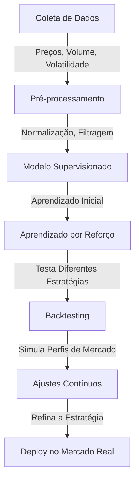

---

## 🎮 Jogos e Cenários de Treinamento

### **1️⃣ Mercado de Baixa Extrema (Bear Market)**
🔹 **Objetivo:** Ensinar o agente a **evitar perdas** e encontrar pontos de entrada seguros.
🔹 **Cenário:** Queda de 10% no mercado em curto tempo.
🔹 **Recompensa:** Evitar perdas acima de 5% e identificar entrada lucrativa.

### **2️⃣ Mercado Lateral (Consolidação)**
🔹 **Objetivo:** Operar eficientemente em **mercados sem tendência**.
🔹 **Cenário:** O preço oscila entre 40.000 e 42.000 USDT.
🔹 **Recompensa:** Acertos dentro da faixa geram ganhos; operar fora resulta em penalizações.

### **3️⃣ Pump & Dump (Volatilidade Extrema)**
🔹 **Objetivo:** Evitar armadilhas e capturar movimentos rápidos.
🔹 **Cenário:** Mercado sobe 15% e depois cai 20% rapidamente.
🔹 **Recompensa:** Correta identificação de entrada segura.

### **4️⃣ Notícias Impactantes**
🔹 **Objetivo:** Adaptar-se a eventos inesperados.
🔹 **Cenário:** Notícia altera o sentimento do mercado.
🔹 **Recompensa:** Ajustar estratégia corretamente conforme a notícia.

### **5️⃣ Flash Crash (Queda Rápida e Recuperação)**
🔹 **Objetivo:** Reagir rapidamente e identificar oportunidades.
🔹 **Cenário:** BTC despenca 10% e recupera 8% logo após.
🔹 **Recompensa:** Comprar no momento certo.

---

## 🔗 Conexões Entre Treinamento e Estratégia

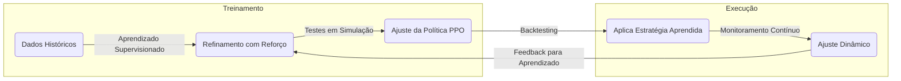

🚀 **Essa estrutura garante que o Agente Nexo aprenda com diferentes cenários e refine continuamente sua estratégia!**

---

🚀 **Esse roteiro garante que o Agente Nexo seja desenvolvido com eficiência e segurança!**

---

## 📓 Notebooks e Análises

Os notebooks do projeto ajudam a analisar e visualizar os dados históricos, permitindo entender tendências e padrões antes do treinamento do modelo.

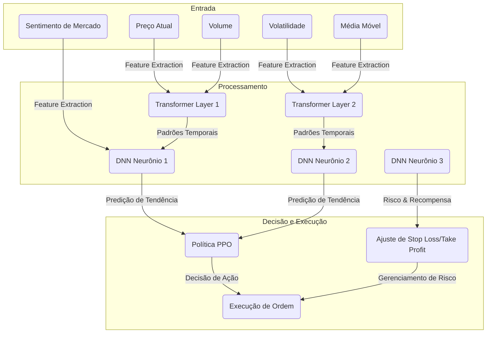

### 📊 Exemplos de Uso dos Notebooks

- `notebooks/data_exploration.ipynb`:

  - Carrega e visualiza séries temporais de preços, volume e indicadores técnicos.
  - Exemplo: Geração de gráficos de candlestick para identificar padrões de movimentação do mercado.

- `notebooks/market_analysis.ipynb`:

  - Compara o desempenho do mercado em diferentes períodos.
  - Exemplo: Comparação do preço do BTC nos últimos 3 meses versus o último ano.

- `notebooks/training_model.ipynb`:

  - Treina a rede neural, ajusta hiperparâmetros e visualiza métricas de aprendizado.
  - Exemplo: Treinamento de uma rede LSTM para prever oscilações futuras do mercado.

- `notebooks/model_performance.ipynb`:

  - Mede o desempenho do modelo usando métricas como **Sharpe Ratio** e **Max Drawdown**.
  - Exemplo: Avaliação do risco/retorno do modelo em diferentes condições de mercado.

- `notebooks/backtesting.ipynb`:

  - Simula o desempenho do modelo em dados históricos.
  - Exemplo: Aplicação de uma estratégia de stop loss em eventos de queda brusca.

- `notebooks/scenario_simulation.ipynb`:

  - Testa o modelo em diferentes condições de mercado, como tendências de alta, baixa e lateralidade.
  - Exemplo: Simulação de um mercado altamente volátil para medir a resiliência do modelo.

Esses notebooks garantem que todas as decisões do agente sejam **testadas e validadas antes de entrar em operação real**.


