# 🏦 Agente Nexo - Investimento Conservador

Este é um programa automático que ajuda a investir em Bitcoin (BTC) na plataforma **Nexo**. Ele segue estratégias **seguras** e **conservadoras**, ajustando os limites de perda (**stop loss**) e ganho (**take profit**) a cada minuto. Além disso, ele envia **notificações pelo Telegram** para que você acompanhe tudo em tempo real. 📩

---

## 📌 Sumário
- [Introdução](#introdução)
- [Objetivos](#objetivos)
- [Como Funciona](#como-funciona)
- [Tecnologias Usadas](#tecnologias-usadas)
- [Instalação](#instalação)
- [Configuração do Agente](#configuração-do-agente)
- [Execução](#execução)
- [Rede Neural e Treinamento](#rede-neural-e-treinamento)
- [Pipeline CI/CD](#pipeline-cicd)
- [Contribuições](#contribuições)
- [Licença](#licença)

---

## 🏁 Introdução

O mercado de criptomoedas muda muito rápido. Este agente usa **inteligência artificial** para analisar os preços do BTC/USDT e decidir automaticamente **quando comprar e quando vender**. Ele sempre busca uma estratégia segura, mantendo o risco baixo. 

Agora, com **notificações via Telegram**, você pode receber mensagens sobre **novas operações**, **ajustes de limite**, **ordens executadas** e **alertas importantes** diretamente no seu celular. 📲

---

## 🎯 Objetivos
✔️ Operar no mercado de futuros BTC/USDT na Nexo.  
✔️ Ajustar **stop loss** e **take profit** automaticamente.  
✔️ Aplicar uma **estratégia segura** para evitar grandes perdas.  
✔️ Controlar **alavancagem** para evitar riscos desnecessários.  
✔️ **Enviar notificações via Telegram** para monitoramento em tempo real.  

---

## 🤖 Como Funciona

O agente usa **inteligência artificial** para analisar o mercado e decidir o melhor momento para comprar ou vender BTC. Ele utiliza uma **rede neural avançada**, que aprende com dados passados para melhorar as decisões futuras.

- **Transformers para analisar padrões de preços** 📈
- **Rede Neural para processar dados do mercado** 🔍
- **Sistema de recompensas para aprender boas estratégias** 🎯

A cada minuto, o agente:
1. Coleta os preços mais recentes do BTC/USDT.
2. Analisa as tendências e padrões do mercado.
3. Ajusta os limites de **stop loss** e **take profit**.
4. Toma decisões sobre **comprar ou vender**.
5. Envia alertas no Telegram com informações importantes.

---

## 🛠️ Tecnologias Usadas
- **Python** 🐍
- **Bibliotecas:**
  - `tensorflow`, `keras` → Rede neural 🧠
  - `transformers` → Análise de padrões 🔎
  - `stable-baselines3` → Aprendizado por reforço 📊
  - `requests` → Comunicação com a API da Nexo 🔗
  - `pandas`, `numpy` → Processamento de dados 📉
  - `schedule` → Execução automática ⏳
  - `telepot` → Notificações no Telegram 📩

---

## 📚 Rede Neural e Treinamento

A **rede neural** do agente é composta por **três módulos principais**:

### 🧠 Arquitetura da Rede Neural
1. **Módulo de Entrada**: Processa os dados do mercado, incluindo preços, volume e volatilidade.
2. **Módulo de Processamento**: Usa **Transformers** para detectar padrões em séries temporais e redes neurais profundas (**DNN**) para refinar a análise dos dados.
3. **Módulo de Decisão**: Implementa **Aprendizado por Reforço Profundo (PPO - Proximal Policy Optimization)** para ajustar automaticamente a estratégia de trading.

### 🔄 Fluxo de Treinamento
1. **Coleta de dados** 📊: Obtém preços do BTC, volume de negociação e outras informações do mercado.
2. **Pré-processamento** 🔍: Filtra dados e remove informações irrelevantes.
3. **Treinamento supervisionado** 🎓: Aprende padrões de comportamento a partir de dados passados.
4. **Treinamento por Reforço (PPO)** 🏆: Testa diferentes estratégias e aprende quais funcionam melhor.
5. **Backtesting** 🔄: Simula operações para ver como o modelo se sairia em diferentes cenários.
6. **Ajustes contínuos** 📈: O agente melhora ao longo do tempo, adaptando-se ao mercado.

### 📊 Diagrama Detalhado da Rede Neural
```mermaid
graph LR;
    subgraph Entrada
        A1(Preço Atual)
        A2(Volume de Negociação)
        A3(Volatilidade)
        A4(Média Móvel)
        A5(Sentimento de Mercado)
    end
    
    subgraph Camada Oculta
        B1(Transformer Layer 1)
        B2(Transformer Layer 2)
        B3(DNN Neurônio 1)
        B4(DNN Neurônio 2)
        B5(DNN Neurônio 3)
    end
    
    subgraph Decisão e Execução
        C1(Política de Ação PPO)
        C2(Ajuste de Stop Loss/Take Profit)
        C3(Execução de Ordem)
    end
    
    A1 -->|Peso| B1
    A2 -->|Peso| B1
    A3 -->|Peso| B2
    A4 -->|Peso| B2
    A5 -->|Peso| B3
    B1 -->|Ativação| B3
    B2 -->|Ativação| B4
    B3 -->|Ativação| C1
    B4 -->|Ativação| C1
    B5 -->|Ativação| C2
    C1 -->|Decisão| C3
    C2 -->|Ajuste de Risco| C3
```

🚀 **Essa arquitetura melhora a capacidade do agente de aprender padrões do mercado e tomar decisões mais assertivas!**

```mermaid
graph TD;
    A[Entrada: Dados do Mercado] -->|Preços, Volume, Volatilidade| B[Pré-processamento]
    B -->|Normalização de Dados| C[Transformers para Séries Temporais]
    C -->|Padrões Identificados| D[Camadas Neurais Densas DNN]
    D -->|Decisão Inicial| E[Política de Ação PPO]
    E -->|Compra/Venda/Manutenção| F[Execução de Ordem]
    E -->|Ajuste Automático de Stop Loss| G[Ajuste de Risco]
    F -->|Feedback para Aprendizado| H[Recompensa/Penalização]
    H -->|Melhoria Contínua| I[Aprendizado por Reforço]
```


---

🚀 **Com essa arquitetura, o agente pode aprender com o mercado, detectar padrões mais rapidamente e melhorar suas decisões ao longo do tempo!**

---

# 📈 Training Scenarios for Agente Nexo

## 🏆 Objetivo
Este documento define diferentes **cenários de treinamento** para o agente Nexo, permitindo que ele aprenda a tomar **decisões de investimento** da melhor forma possível em **diferentes condições de mercado**.

O treinamento será dividido em **jogos/simulações**, onde o agente enfrentará desafios e aprenderá **estratégias vencedoras**.

---

## 🎮 Jogos e Cenários de Treinamento

### **1️⃣ Jogo: Mercado de Baixa Extrema (Bear Market)**
🔹 **Objetivo:** Ensinar o agente a **evitar perdas** e identificar pontos de entrada seguros.
🔹 **Cenário:**
   - O mercado cai 10% em um curto período.
   - O agente precisa decidir se **mantém a posição, vende ou espera**.
   - Se ele vender muito cedo, pode perder um possível repique.
   - Se ele segurar muito tempo, pode sofrer grandes perdas.
🔹 **Recompensa:**
   - Se evitar perdas acima de 5% e encontrar um **ponto de entrada lucrativo**, recebe uma **recompensa alta**.
   - Se segurar demais e não conseguir recuperar, recebe **penalização**.

### **2️⃣ Jogo: Mercado Lateral (Consolidação)**
🔹 **Objetivo:** Ensinar o agente a operar em **mercados sem tendência**.
🔹 **Cenário:**
   - O preço oscila entre 40.000 e 42.000 USDT.
   - O agente deve aprender a **comprar na parte inferior e vender na parte superior**.
   - Se ele operar fora dessas faixas, pode sofrer **prejuízos desnecessários**.
🔹 **Recompensa:**
   - Se fizer **entradas e saídas precisas dentro da faixa**, recebe **recompensa alta**.
   - Se comprar ou vender nos momentos errados, recebe **penalização**.

### **3️⃣ Jogo: Pump & Dump (Volatilidade Extrema)**
🔹 **Objetivo:** Ensinar o agente a **evitar armadilhas e capturar movimentos rápidos**.
🔹 **Cenário:**
   - O mercado sobe rapidamente 15% e depois cai 20%.
   - O agente precisa decidir **se entra na alta ou espera uma correção**.
🔹 **Recompensa:**
   - Se identificar corretamente um **ponto de entrada seguro**, recebe **recompensa**.
   - Se entrar muito tarde e sofrer perdas com a correção, recebe **penalização**.

### **4️⃣ Jogo: Notícias Impactantes**
🔹 **Objetivo:** Ensinar o agente a **adaptar-se a eventos inesperados**.
🔹 **Cenário:**
   - Uma **notícia impactante** surge, alterando o sentimento do mercado.
   - O agente deve identificar se a notícia **gera uma nova tendência ou apenas ruído**.
🔹 **Recompensa:**
   - Se ajustar sua estratégia corretamente de acordo com a **notícia**, recebe **recompensa alta**.
   - Se entrar cedo demais ou ignorar o impacto real, recebe **penalização**.

### **5️⃣ Jogo: Flash Crash (Queda Rápida e Recuperação)**
🔹 **Objetivo:** Ensinar o agente a **reagir rapidamente e identificar oportunidades**.
🔹 **Cenário:**
   - O BTC despenca 10% em minutos, mas recupera 8% logo depois.
   - O agente precisa aprender a **não vender no pânico** e procurar oportunidades de compra.
🔹 **Recompensa:**
   - Se conseguir **comprar no momento certo**, recebe **recompensa alta**.
   - Se vender no fundo por medo, recebe **penalização**.

---

## 🧠 Como o Agente Aprende a Melhor Estratégia?

1. **Simulações Massivas**
   - O agente é testado **milhares de vezes** em cada cenário.
   - Cada simulação ajusta os pesos da rede neural para **evitar erros futuros**.

2. **Recompensa por Decisões Certas**
   - O modelo de aprendizado por reforço **recompensa boas decisões** e **penaliza erros**.
   - Cada jogo reforça **padrões de comportamento eficiente**.

3. **Ajustes Contínuos**
   - Após o treinamento inicial, o agente continua aprendendo **com o mercado ao vivo**.
   - Se um novo padrão de mercado surgir, o agente pode **se adaptar automaticamente**.

---

🚀 **Com esses jogos de treinamento, o agente poderá operar de forma mais inteligente e segura no mercado de futuros BTC/USDT!**


---

## 1. Estrutura do Projeto
```
nexo_futures_ai/
│-- data/                # Armazena dados brutos e processados
│-- models/              # Modelos treinados e checkpoints
│-- scripts/             # Scripts de execução rápida
│-- notebooks/           # Notebooks para exploração de dados e testes
│-- configs/             # Configurações do projeto
│-- logs/                # Logs de execução e treinamento
│-- src/                 # Código-fonte principal
│   │-- __init__.py      # Torna 'src' um pacote Python
│   │-- data_loader.py   # Carrega e processa os dados
│   │-- model.py         # Define a rede neural
│   │-- train.py         # Script de treinamento do modelo
│   │-- evaluate.py      # Avalia o modelo treinado
│   │-- utils.py         # Funções auxiliares
│-- README.md            # Documentação do projeto
│-- .gitignore           # Arquivos a serem ignorados pelo Git
│-- requirements.txt     # Lista de dependências do projeto
│-- configs/config.yaml  # Arquivo de configuração
```

## 2. Explicação de Cada Arquivo

### Diretórios:
- **data/**: Armazena os dados brutos (ex: histórico de preços) e os dados processados.
- **models/**: Guarda os modelos treinados e checkpoints para futuras execuções.
- **scripts/**: Scripts utilitários que podem ser rodados separadamente.
- **notebooks/**: Contém Jupyter Notebooks para análise e testes interativos.
- **configs/**: Armazena arquivos de configuração para parametrização do projeto.
- **logs/**: Contém arquivos de log gerados durante execuções do treinamento e testes.
- **src/**: Contém o código-fonte principal do projeto.

### Arquivos:
- **README.md**: Explica o objetivo do projeto, como rodá-lo e suas dependências.
- **.gitignore**: Arquivo que informa ao Git quais arquivos e pastas devem ser ignorados no versionamento.
- **requirements.txt**: Lista todas as dependências (bibliotecas) que o projeto precisa para rodar corretamente.
- **configs/config.yaml**: Define configurações do projeto, como hiperparâmetros e caminhos dos dados.

### Arquivos em `src/`:
- **__init__.py**: Torna a pasta um pacote Python, permitindo importação de módulos.
- **data_loader.py**: Contém funções para carregar, limpar e processar os dados de entrada.
- **model.py**: Define a arquitetura da rede neural (ex: LSTM, CNN, MLP).
- **train.py**: Responsável por treinar o modelo usando os dados de entrada.
- **evaluate.py**: Mede o desempenho do modelo treinado usando métricas de avaliação.
- **utils.py**: Contém funções auxiliares como normalização de dados e visualização.

Essa estrutura ajuda a manter o projeto organizado e modular, facilitando o desenvolvimento e a manutenção.

---

## Tests

Aqui está um roteiro detalhado para a criação do projeto **Agente Nexo - Investimento Conservador**.

---

## 📌 **Roteiro para a Criação do Projeto**

### **1️⃣ Planejamento Inicial**
1. **Definir os objetivos do agente**
   - O agente deve operar de forma conservadora no mercado de futuros BTC/USDT.
   - Ajuste dinâmico de **stop loss** e **take profit** para evitar perdas excessivas.
   - Envio de notificações via **Telegram** para monitoramento contínuo.

2. **Escolher as tecnologias e ferramentas**
   - **Linguagem**: Python
   - **Frameworks para Machine Learning**: TensorFlow, Keras, Stable-Baselines3
   - **APIs**: API da Nexo para ordens e preços
   - **Banco de Dados**: SQLite/PostgreSQL (para armazenar histórico de operações)
   - **Serviço de Mensageria**: Telegram Bot API
   - **Ferramentas de CI/CD**: GitHub Actions + Docker

---

### **2️⃣ Coleta e Processamento de Dados**
1. **Coletar dados de mercado**
   - Criar um script Python para acessar a API da Nexo e buscar preços, volumes, médias móveis e volatilidade.
   - Armazenar os dados em um banco de dados.

2. **Pré-processamento dos dados**
   - Remover outliers e normalizar dados.
   - Criar novos indicadores técnicos relevantes para a decisão do agente.

---

### **3️⃣ Desenvolvimento da Rede Neural**
1. **Definição da Arquitetura**
   - **Entrada**: Preço atual, volume, volatilidade, médias móveis, sentimento de mercado.
   - **Camada Oculta**:
     - **Transformers** para análise de séries temporais.
     - **Redes Neurais Densas (DNNs)** para combinação de múltiplas features.
   - **Saída**:
     - Decisão de **compra, venda ou manutenção** da posição.
     - Ajuste dinâmico de **stop loss** e **take profit**.

2. **Treinamento do Modelo**
   - Treinar inicialmente com **dados históricos** para aprendizado supervisionado.
   - Refinar a estratégia com **Aprendizado por Reforço Profundo (PPO)**.
   - Realizar **backtesting** para testar a eficiência do modelo antes da implantação.

---

### **4️⃣ Implementação do Sistema de Execução de Ordens**
1. **Conectar o agente à API da Nexo**
   - Criar funções para enviar ordens de compra e venda.
   - Monitorar posições abertas e ajustar **stop loss** e **take profit** dinamicamente.

2. **Gerenciamento de Risco**
   - Implementar controle de alavancagem baseado na volatilidade do mercado.
   - Aplicar regras para evitar **overtrading**.

---

### **5️⃣ Integração de Notificações e Monitoramento**
1. **Configurar bot no Telegram**
   - Criar um bot e obter o token API.
   - Implementar funções para envio de mensagens sobre novas operações e ajustes de risco.

2. **Gerar Logs e Alertas**
   - Registrar todas as operações em um arquivo de log e banco de dados.
   - Criar um dashboard (opcional) para visualização do desempenho.

---

### **6️⃣ Automação com CI/CD**
1. **Configurar GitHub Actions**
   - Criar um workflow para rodar testes automatizados em cada push.
   - Configurar deploy automático para um servidor remoto.

2. **Containerização com Docker**
   - Criar um `Dockerfile` para facilitar a implantação do agente em servidores diferentes.
   - Configurar um `docker-compose.yml` para rodar o banco de dados e o agente.

---

### **7️⃣ Testes e Validação**
1. **Testes Unitários**
   - Criar testes para garantir que o agente esteja tomando decisões corretas.
   - Testar integração com a API da Nexo.

2. **Backtesting**
   - Simular estratégias em dados passados para verificar o desempenho.

3. **Teste em ambiente real (com capital reduzido)**
   - Rodar o agente em conta real com pequeno capital antes da implantação definitiva.

---

### **8️⃣ Implantação e Manutenção**
1. **Deploy final do agente**
   - Executar o agente 24/7 em um servidor seguro.
   - Monitorar logs e performance.

2. **Melhorias Contínuas**
   - Ajustar a rede neural conforme o mercado muda.
   - Implementar novas métricas para análise de desempenho.

---

🚀 **Esse roteiro garante que o Agente Nexo seja desenvolvido com eficiência e segurança!**

---

📓 Notebooks e Análises

Os notebooks do projeto ajudam a analisar e visualizar os dados históricos, permitindo entender tendências e padrões antes do treinamento do modelo.

notebooks/data_exploration.ipynb: Visualiza séries temporais de preços, volume e indicadores técnicos.

notebooks/market_analysis.ipynb: Gera gráficos comparativos entre diferentes períodos de tempo.

notebooks/training_model.ipynb: Treina a rede neural, ajusta hiperparâmetros e visualiza métricas de aprendizado.

notebooks/model_performance.ipynb: Mede o desempenho do modelo usando métricas como Sharpe Ratio e Max Drawdown.

notebooks/backtesting.ipynb: Simula o desempenho do modelo em dados históricos e avalia seu potencial de lucro.

notebooks/scenario_simulation.ipynb: Testa o modelo em diferentes condições de mercado, como tendências de alta, baixa e lateralidade.

Esses notebooks garantem que todas as decisões do agente sejam testadas e validadas antes de entrar em operação real.


