# 🏦 Agente Nexo - Investimento Conservador

Este é um programa automático que ajuda a investir em Bitcoin (BTC) na plataforma **Nexo**. Ele segue estratégias **seguras** e **conservadoras**, ajustando os limites de perda (**stop loss**) e ganho (**take profit**) a cada minuto. Além disso, ele envia **notificações pelo Telegram** para que você acompanhe tudo em tempo real. 📩

---

## 📌 Sumário
- [Introdução](#introdução)
- [Objetivos](#objetivos)
- [Como Funciona](#como-funciona)
- [Tecnologias Usadas](#tecnologias-usadas)
- [Instalação](#instalação)
- [Configuração do Agente](#configuração-do-agente)
- [Execução](#execução)
- [Rede Neural e Treinamento](#rede-neural-e-treinamento)
- [Pipeline CI/CD](#pipeline-cicd)
- [Contribuições](#contribuições)
- [Licença](#licença)

---

## 🏁 Introdução

O mercado de criptomoedas muda muito rápido. Este agente usa **inteligência artificial** para analisar os preços do BTC/USDT e decidir automaticamente **quando comprar e quando vender**. Ele sempre busca uma estratégia segura, mantendo o risco baixo. 

Agora, com **notificações via Telegram**, você pode receber mensagens sobre **novas operações**, **ajustes de limite**, **ordens executadas** e **alertas importantes** diretamente no seu celular. 📲

---

## 🎯 Objetivos
✔️ Operar no mercado de futuros BTC/USDT na Nexo.  
✔️ Ajustar **stop loss** e **take profit** automaticamente.  
✔️ Aplicar uma **estratégia segura** para evitar grandes perdas.  
✔️ Controlar **alavancagem** para evitar riscos desnecessários.  
✔️ **Enviar notificações via Telegram** para monitoramento em tempo real.  

---

## 🤖 Como Funciona

O agente usa **inteligência artificial** para analisar o mercado e decidir o melhor momento para comprar ou vender BTC. Ele utiliza uma **rede neural avançada**, que aprende com dados passados para melhorar as decisões futuras.

- **Transformers para analisar padrões de preços** 📈
- **Rede Neural para processar dados do mercado** 🔍
- **Sistema de recompensas para aprender boas estratégias** 🎯

A cada minuto, o agente:
1. Coleta os preços mais recentes do BTC/USDT.
2. Analisa as tendências e padrões do mercado.
3. Ajusta os limites de **stop loss** e **take profit**.
4. Toma decisões sobre **comprar ou vender**.
5. Envia alertas no Telegram com informações importantes.

---

## 🛠️ Tecnologias Usadas
- **Python** 🐍
- **Bibliotecas:**
  - `tensorflow`, `keras` → Rede neural 🧠
  - `transformers` → Análise de padrões 🔎
  - `stable-baselines3` → Aprendizado por reforço 📊
  - `requests` → Comunicação com a API da Nexo 🔗
  - `pandas`, `numpy` → Processamento de dados 📉
  - `schedule` → Execução automática ⏳
  - `telepot` → Notificações no Telegram 📩

---

## 📚 Rede Neural e Treinamento

A **rede neural** do agente é composta por **três módulos principais**:

### 🧠 Arquitetura da Rede Neural
1. **Módulo de Entrada**: Processa os dados do mercado, incluindo preços, volume e volatilidade.
2. **Módulo de Processamento**: Usa **Transformers** para detectar padrões em séries temporais e redes neurais profundas (**DNN**) para refinar a análise dos dados.
3. **Módulo de Decisão**: Implementa **Aprendizado por Reforço Profundo (PPO - Proximal Policy Optimization)** para ajustar automaticamente a estratégia de trading.

### 🔄 Fluxo de Treinamento
1. **Coleta de dados** 📊: Obtém preços do BTC, volume de negociação e outras informações do mercado.
2. **Pré-processamento** 🔍: Filtra dados e remove informações irrelevantes.
3. **Treinamento supervisionado** 🎓: Aprende padrões de comportamento a partir de dados passados.
4. **Treinamento por Reforço (PPO)** 🏆: Testa diferentes estratégias e aprende quais funcionam melhor.
5. **Backtesting** 🔄: Simula operações para ver como o modelo se sairia em diferentes cenários.
6. **Ajustes contínuos** 📈: O agente melhora ao longo do tempo, adaptando-se ao mercado.

### 📊 Diagrama Detalhado da Rede Neural
```mermaid
graph LR;
    subgraph Entrada
        A1(Preço Atual)
        A2(Volume de Negociação)
        A3(Volatilidade)
        A4(Média Móvel)
        A5(Sentimento de Mercado)
    end
    
    subgraph Camada Oculta
        B1(Transformer Layer 1)
        B2(Transformer Layer 2)
        B3(DNN Neurônio 1)
        B4(DNN Neurônio 2)
        B5(DNN Neurônio 3)
    end
    
    subgraph Decisão e Execução
        C1(Política de Ação PPO)
        C2(Ajuste de Stop Loss/Take Profit)
        C3(Execução de Ordem)
    end
    
    A1 -->|Peso| B1
    A2 -->|Peso| B1
    A3 -->|Peso| B2
    A4 -->|Peso| B2
    A5 -->|Peso| B3
    B1 -->|Ativação| B3
    B2 -->|Ativação| B4
    B3 -->|Ativação| C1
    B4 -->|Ativação| C1
    B5 -->|Ativação| C2
    C1 -->|Decisão| C3
    C2 -->|Ajuste de Risco| C3
```

🚀 **Essa arquitetura melhora a capacidade do agente de aprender padrões do mercado e tomar decisões mais assertivas!**

```mermaid
graph TD;
    A[Entrada: Dados do Mercado] -->|Preços, Volume, Volatilidade| B[Pré-processamento]
    B -->|Normalização de Dados| C[Transformers para Séries Temporais]
    C -->|Padrões Identificados| D[Camadas Neurais Densas DNN]
    D -->|Decisão Inicial| E[Política de Ação PPO]
    E -->|Compra/Venda/Manutenção| F[Execução de Ordem]
    E -->|Ajuste Automático de Stop Loss| G[Ajuste de Risco]
    F -->|Feedback para Aprendizado| H[Recompensa/Penalização]
    H -->|Melhoria Contínua| I[Aprendizado por Reforço]
```


---

🚀 **Com essa arquitetura, o agente pode aprender com o mercado, detectar padrões mais rapidamente e melhorar suas decisões ao longo do tempo!**

