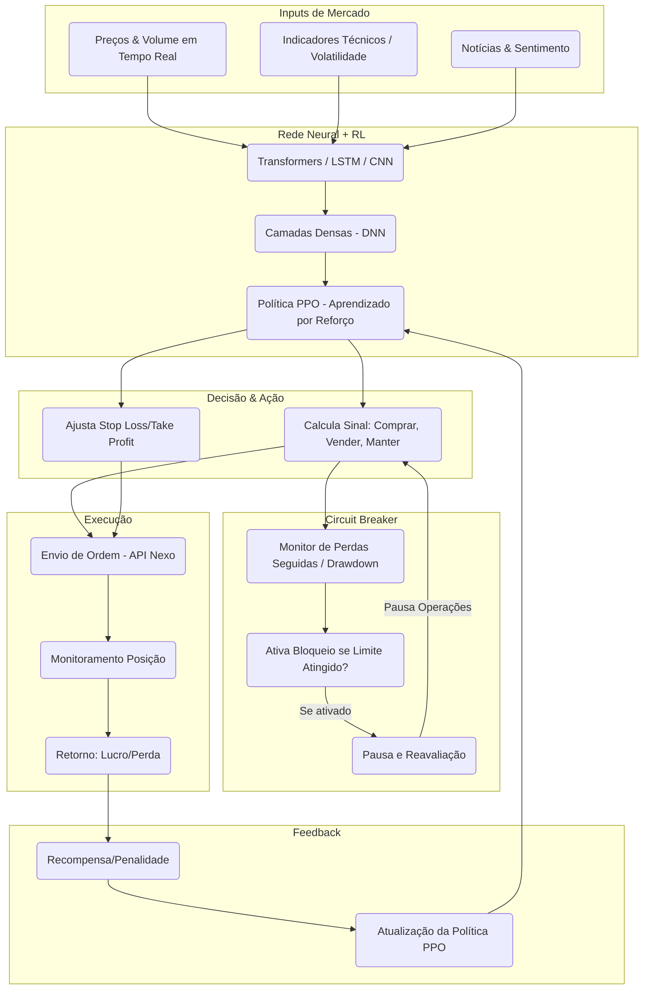
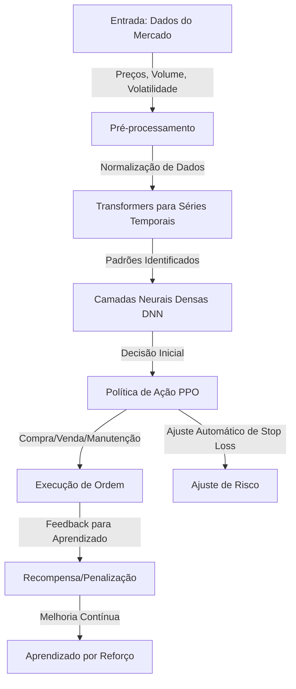

## 📚 Agent

A **rede neural** do agente é composta por **três módulos principais**:

### 🧠 Arquitetura da Rede Neural
1. **Módulo de Entrada**: Processa os dados do mercado, incluindo preços, volume e volatilidade.
2. **Módulo de Processamento**: Usa **Transformers** para detectar padrões em séries temporais e redes neurais profundas (**DNN**) para refinar a análise dos dados.
3. **Módulo de Decisão**: Implementa **Aprendizado por Reforço Profundo (PPO - Proximal Policy Optimization)** para ajustar automaticamente a estratégia de trading.

### 🔄 Fluxo de Treinamento
1. **Coleta de dados** 📊: Obtém preços do BTC, volume de negociação e outras informações do mercado.
2. **Pré-processamento** 🔍: Filtra dados e remove informações irrelevantes.
3. **Treinamento supervisionado** 🎓: Aprende padrões de comportamento a partir de dados passados.
4. **Treinamento por Reforço (PPO)** 🏆: Testa diferentes estratégias e aprende quais funcionam melhor.
5. **Backtesting** 🔄: Simula operações para ver como o modelo se sairia em diferentes cenários.
6. **Ajustes contínuos** 📈: O agente melhora ao longo do tempo, adaptando-se ao mercado.

### 📊 Diagrama Detalhado da Rede Neural

---

# 📈 Training Scenarios for Agente Nexo

## 🏆 Objetivo
Este documento define diferentes **cenários de treinamento** para o agente Nexo, permitindo que ele aprenda a tomar **decisões de investimento** da melhor forma possível em **diferentes condições de mercado**.

O treinamento será dividido em **jogos/simulações**, onde o agente enfrentará desafios e aprenderá **estratégias vencedoras**.

---

## 🎮 Jogos e Cenários de Treinamento

### **1️⃣ Jogo: Mercado de Baixa Extrema (Bear Market)**
🔹 **Objetivo:** Ensinar o agente a **evitar perdas** e identificar pontos de entrada seguros.
🔹 **Cenário:**
   - O mercado cai 10% em um curto período.
   - O agente precisa decidir se **mantém a posição, vende ou espera**.
   - Se ele vender muito cedo, pode perder um possível repique.
   - Se ele segurar muito tempo, pode sofrer grandes perdas.
🔹 **Recompensa:**
   - Se evitar perdas acima de 5% e encontrar um **ponto de entrada lucrativo**, recebe uma **recompensa alta**.
   - Se segurar demais e não conseguir recuperar, recebe **penalização**.

### **2️⃣ Jogo: Mercado Lateral (Consolidação)**
🔹 **Objetivo:** Ensinar o agente a operar em **mercados sem tendência**.
🔹 **Cenário:**
   - O preço oscila entre 40.000 e 42.000 USDT.
   - O agente deve aprender a **comprar na parte inferior e vender na parte superior**.
   - Se ele operar fora dessas faixas, pode sofrer **prejuízos desnecessários**.
🔹 **Recompensa:**
   - Se fizer **entradas e saídas precisas dentro da faixa**, recebe **recompensa alta**.
   - Se comprar ou vender nos momentos errados, recebe **penalização**.

### **3️⃣ Jogo: Pump & Dump (Volatilidade Extrema)**
🔹 **Objetivo:** Ensinar o agente a **evitar armadilhas e capturar movimentos rápidos**.
🔹 **Cenário:**
   - O mercado sobe rapidamente 15% e depois cai 20%.
   - O agente precisa decidir **se entra na alta ou espera uma correção**.
🔹 **Recompensa:**
   - Se identificar corretamente um **ponto de entrada seguro**, recebe **recompensa**.
   - Se entrar muito tarde e sofrer perdas com a correção, recebe **penalização**.

### **4️⃣ Jogo: Notícias Impactantes**
🔹 **Objetivo:** Ensinar o agente a **adaptar-se a eventos inesperados**.
🔹 **Cenário:**
   - Uma **notícia impactante** surge, alterando o sentimento do mercado.
   - O agente deve identificar se a notícia **gera uma nova tendência ou apenas ruído**.
🔹 **Recompensa:**
   - Se ajustar sua estratégia corretamente de acordo com a **notícia**, recebe **recompensa alta**.
   - Se entrar cedo demais ou ignorar o impacto real, recebe **penalização**.

### **5️⃣ Jogo: Flash Crash (Queda Rápida e Recuperação)**
🔹 **Objetivo:** Ensinar o agente a **reagir rapidamente e identificar oportunidades**.
🔹 **Cenário:**
   - O BTC despenca 10% em minutos, mas recupera 8% logo depois.
   - O agente precisa aprender a **não vender no pânico** e procurar oportunidades de compra.
🔹 **Recompensa:**
   - Se conseguir **comprar no momento certo**, recebe **recompensa alta**.
   - Se vender no fundo por medo, recebe **penalização**.

---

┌─────────────────────────────────────────────────────────────────────────┐
│        SISTEMA DE MEDALHAS BASEADO EM LUCRO E MÉTRICAS DE PERFORMANCE  │
└─────────────────────────────────────────────────────────────────────────┘

A ideia é que as **medalhas** sejam concedidas aos indivíduos (modelos) que conseguem se **manter lucrativos** ao longo dos cenários de teste, mas também respeitando métricas adicionais de **risco** e **consistência**. Abaixo, apresento um esquema mais detalhado para integrar **lucro**, **drawdown**, **taxa de acerto** e outras estatísticas.

## 1. Pontuação Geral (Score)

Para que cada indivíduo seja avaliado de forma **objetiva**, podemos criar um **Score Global** que agregue vários indicadores. Por exemplo:

1. **Lucro Acumulado** (Profit Factor)
   - Mede o total de lucro (ou prejuízo) ao final dos cenários de teste.
   - Ex.: Se o modelo terminou com +15% sobre o capital inicial, recebe uma pontuação proporcional.

2. **Stability Score** (Drawdown e Volatilidade)
   - Penaliza modelos que geram picos de perda (max drawdown) ou têm comportamento muito volátil.
   - Ex.: Se o max drawdown for menor que 15%, recebe um bônus na pontuação final.

3. **Consistência de Retornos** (Sharpe ou Sortino Ratio)
   - Avalia se o modelo gera um **retorno estável**, ajustado ao risco.
   - Ex.: Quanto maior o Sharpe/Sortino Ratio, maior a pontuação.

4. **Taxa de Acerto** / **Taxa de Operações Lucrativas**
   - Mede quantos trades terminaram no lucro em relação ao total.
   - Mesmo com bom lucro, se a taxa de acerto for muito baixa, a pontuação final cai.

5. **Performance em Múltiplos Cenários** (Bear, Lateral, Pump & Dump, etc.)
   - Verifica se o indivíduo **não “bamba”** em algum cenário.  
   - Modelos que conseguem manter a **lucratividade** em todos os cenários recebem pontuação adicional.

> **Fórmula genérica**:  
> \[
> \text{Score Global} = w_1 \times \text{Lucro} \;+\; w_2 \times \text{Estabilidade} \;+\; w_3 \times \text{Consistência} \;+\; w_4 \times \text{Taxa de Acerto} \;+\; w_5 \times \text{MultiCenários}
> \]  
> Onde \(w_i\) são pesos que você define para cada indicador, priorizando a “filosofia” do projeto (ex.: conservador → peso maior em estabilidade e drawdown).

---

## 2. Regras Básicas para Ganhar Medalha

- **Regra Geral**: O modelo **deve** terminar os cenários **lucrativo** (lucro >= 0) para ser elegível a qualquer medalha.  
- **Restrições de Segurança**:  
  - Se o drawdown excede 30%, o modelo fica **desclassificado** de premiações altas (apenas recebe “bronze” ou nenhuma).  
  - Se a taxa de acerto for muito baixa (ex.: < 40%), também não passa de “bronze” ou “sem medalha”.  

**Pontuação Final** → **Medalha**:
- **Ouro**: Score Global >= 80 + lucros positivos em todos os cenários.  
- **Prata**: Score Global entre 65 e 79 + não teve drawdown > 25%.  
- **Bronze**: Score Global entre 50 e 64 + não teve drawdown > 30%.  
- **Sem Medalha**: Abaixo de 50 pontos ou lucro negativo.

*(Obs.: Os números acima são exemplos, adapte conforme sua análise e amplitude de valores.)*

---

## 3. Possível Exemplo de Cálculo

**Exemplo** de como pontuar um modelo ao final dos “jogos”:

| Indicador                | Valor Exemplo   | Conversão em Pontos   |
|--------------------------|-----------------|------------------------|
| Lucro Total             | +12%            | +30 pontos            |
| Drawdown Máximo         | 18%             | +20 pontos (pequena penalidade) |
| Sharpe Ratio            | 1.8             | +20 pontos            |
| Taxa de Acerto Geral    | 58%             | +10 pontos            |
| Cenários Sem Perdas     | 4 de 5          | +10 pontos            |

> **Score Global** = 30 + 20 + 20 + 10 + 10 = **90** → **Medalha de Ouro**  
> (Pois foi lucrativo e pontuou acima de 80.)

Outro modelo, com 8% de lucro, 25% drawdown e Sharpe 1.2, pode ter:
- Lucro +25 pontos  
- Drawdown 25% +10 pontos  
- Sharpe 1.2 +15 pontos  
- Acerto 50% +5 pontos  
- Cenários sem perdas 3/5 +5 pontos  
**Score = 25+10+15+5+5= 60** → **Medalha de Bronze** (exemplo de corte).

---

## 4. Gamificação com Medalhas Especiais

Além das medalhas principais (Ouro/Prata/Bronze), você pode ter **conquistas extras** relacionadas especificamente ao **lucro** em cada cenário, por exemplo:

1. **“Investidor de Aço”**  
   - Quando o modelo mantém **lucro positivo** mesmo em Bear Market severo, sem drawdown acima de 20%.

2. **“Sniper de Volatilidade”**  
   - Quando captura lucros acima de x% em cenários de **Pump & Dump**, entrando e saindo “no ponto”.

3. **“Blindado contra Flash Crash”**  
   - Zero posições liquidadas durante um flash crash, mantendo-se ainda no verde (lucro >= 0).

Essas medalhas especiais **incentivam** a excelência em aspectos específicos do mercado.

---

## 5. Resumo e Conclusão

Com esse **sistema de medalhas** orientado a **lucratividade e métricas de risco**, você:

1. **Garante** que apenas indivíduos efetivamente lucrativos recebam medalhas.  
2. **Premia** a consistência e estabilidade, alinhada ao foco conservador.  
3. **Adota** um Score Global que equilibra múltiplos indicadores (lucro, drawdown, Sharpe, taxa de acerto).  
4. **Gamifica** o aprendizado, criando um ranking onde cada modelo (indivíduo) busca pontuar o máximo possível nos cenários de simulação.

---

## 🧠 Como o Agente Aprende a Melhor Estratégia?

1. **Simulações Massivas**
   - O agente é testado **milhares de vezes** em cada cenário.
   - Cada simulação ajusta os pesos da rede neural para **evitar erros futuros**.

2. **Recompensa por Decisões Certas**
   - O modelo de aprendizado por reforço **recompensa boas decisões** e **penaliza erros**.
   - Cada jogo reforça **padrões de comportamento eficiente**.

3. **Ajustes Contínuos**
   - Após o treinamento inicial, o agente continua aprendendo **com o mercado ao vivo**.
   - Se um novo padrão de mercado surgir, o agente pode **se adaptar automaticamente**.

---

🚀 **Com esses jogos de treinamento, o agente poderá operar de forma mais inteligente e segura no mercado de futuros BTC/USDT!**

